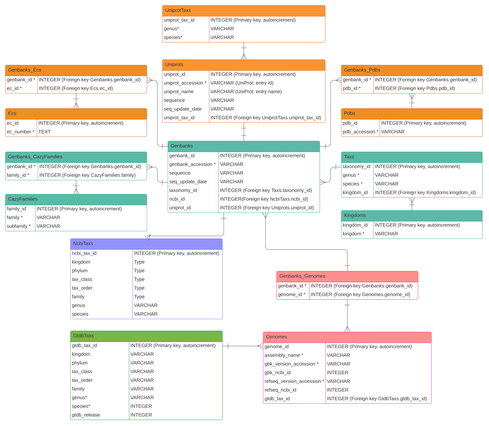

# cazy_webscraper

-------------------------------

[](https://doi.org/10.5281/zenodo.6343936)
[](https://github.com/HobnobMancer/cazy_webscraper/blob/master/LICENSE)  
[](https://circleci.com/gh/HobnobMancer/cazy_webscraper)
[](https://codecov.io/gh/HobnobMancer/cazy_webscraper)
[](https://cazy-webscraper.readthedocs.io/en/latest/?badge=latest)  
[](https://anaconda.org/bioconda/cazy_webscraper)
[](https://anaconda.org/bioconda/cazy_webscraper)  
[](https://pypi.python.org/pypi/cazy_webscraper)  
[](https://pepy.tech/project/cazy-webscraper)  
[](https://github.com/HobnobMancer/cazy_webscraper/actions/workflows/main.yml)

--------------------------------

> [!CAUTION]
> This is the development branch. It is not stable.

> [!IMPORTANT]
> This branch includes a significantly faster and lightweight deployment of `cazy_webscraper`, capable
> of compiling a local CAZyme database containing all CAZyme records from CAZy in 2m5s on a 
> standard office laptop.
> Supported features:
> - downloading CAZy and building a local CAZyme database
> - retrieving genomic assembly information from NCBI
> - retrieving protein sequence database from NCBI
> - retrieving taxonomic classifications from NCBI

`cazy_webscraper` is an application for the automated retrieval of protein and annotation data from the [CAZy](http://wwww.cazy.org/) database and builds a local SQLite3 database, enabling users to integrate the dataset into analytical pipelines in a manner unachievable through the CAZy website. Successive queries can be collated into a single local database, and a log of each query is recorded in the database for transparency, reproducibility and shareability.

The full documentation can be found at [Read the Docs](https://cazy-webscraper.readthedocs.io/en/latest/?badge=latest).

For full details see our publication in [Microbial Genomics](https://www.microbiologyresearch.org/content/journal/mgen/10.1099/mgen.0.001086), which includes example analyses.

> Hobbs, E. E. M, Gloster, T. M., Pritchard, L. (2023) cazy_webscraper: local compilation and interrogation of comprehensive CAZyme datasets, _Microbial Genomics_, 9(8). [https://doi.org/10.1099/mgen.0.001086](https://doi.org/10.1099/mgen.0.001086)

--------------------------------

**Retrieve for user-defined datasets of interest.** `cazy_webscraper` can recover specified CAZy Classes and/or CAZy families and these queries can be further filtered by taxonomy at the Kingdom, genus, species or strain level. 

**Enhance the CAZy dataset.** `cazy_webscraper` can retrieve and add to a local CAZyme database additional data from the following external databases :

* **[GenBank](https://www.ncbi.nlm.nih.gov/genbank/):**  
    - Protein sequences 
    - Complete taxonomic lineages (domain, superkingdom, phylum, class, order and family)
    - Latest genomic assembly version accessions and IDs - GenBank and RefSeq (when available)
- **[UniProt](https://www.uniprot.org/):** 
    - UniProt ID/accession
    - UniParc sequence ID
    - Protein name
    - EC numbers
    - PDB accessions
    - GO terms
    - Protein sequence (and date sequence was last updated)

> [!NOTE]
> The following features are still under construction

- **[RCSB Protein Data Bank (RSCB PDB)](https://www.rcsb.org/):**
    - Protein structure files - *Structure files are written to disk, **not** stored in the local CAZyme database*
- **[Genome Taxonomy Database (GTDB)](https://gtdb.ecogenomic.org/):**
    - Complete archaeal and bacterial lineages
- **[Pfam](https://www.ebi.ac.uk/interpro/):**
    - Pfam family annotations, which includes non-CAZyme domain annotations
 
**Easily extract sequences from a local CAZyme database:** Use the `extract_data` subcommand to extract sequence data to a FASTA or BLAST database. 

## New in version 3.0.0

* Simplified command-line interface with a single `cazy_webscraper` command with subcommands.
* Significantly faster and less memory demanding.
* Intergation of [GO (GeneOntology) terms](https://www.geneontology.org/)
* Integration of Pfam family and domain annotations (WIP)

## Migrating from version 2

Version 3 changes two things that affect every version 2 user. The
[migration guide](https://cazy-webscraper.readthedocs.io/en/latest/migration.html) covers both in
full, along with the renamed arguments for each subcommand; this is the short version.

**1. One command instead of ten.** The separate `cw_*` scripts are now subcommands:

| Version 2 | Version 3 |
| --- | --- |
| `cazy_webscraper <email>` | `cazy_webscraper download_cazy <email>` |
| `cw_get_genbank_seqs <db> <email>` | `cazy_webscraper get_ncbi_seqs <db> <email>` |
| `cw_get_ncbi_taxs <db> <email>` | `cazy_webscraper get_ncbi_taxs <db> <email>` |
| `cw_get_genomics <db> <email>` | `cazy_webscraper get_ncbi_genomes <db> <email>` |
| `cw_get_uniprot_data <db>` | `cazy_webscraper get_uniprot_data <db>` |
| `cw_get_pdb_structures <db> <formats>` | `cazy_webscraper get_pdb_structures <db> --file_formats <formats>` |
| `cw_get_gtdb_taxs <db> <taxs>` | `cazy_webscraper get_gtdb_taxs <db> --taxs <taxs>` |
| `cw_query_database <db> <file_types>` | `cazy_webscraper extract_data <db> --file_types csv json` |
| `cw_extract_db_seqs <db> <source>` | `cazy_webscraper extract_data <db> --file_types fasta --source <source>` |
| `cw_get_db_schema` | Not yet migrated |

The two version 2 commands for getting data back *out* of a database were merged: the CSV/JSON
output of `cw_query_database` and the FASTA/BLAST output of `cw_extract_db_seqs` are both
`extract_data` now, selected with `--file_types csv|json|fasta|fasta_dir|blastdb`.

Note that `--version`, `--citation`, `-l`/`--log`, `--sql_echo` and `-v`/`--verbose` now belong to
`cazy_webscraper` itself and must come *before* the subcommand:

```bash
# version 2
cw_get_ncbi_taxs cazy.db user@example.com --verbose --log run.log

# version 3
cazy_webscraper -v -l run.log get_ncbi_taxs cazy.db user@example.com
```

Most other arguments keep their names. The main exception is that version 2's assorted update flags
(`--seq_update`, `--update_taxs`, `--update_name`, `--update_genome_lineage`, ...) have each
collapsed into a single `--update` per subcommand.

**2. Databases built with version 2 must be rebuilt.** The central `Genbanks` table is now
`Proteins` (with `protein_accession` in place of `genbank_accession`), the association tables were
renamed to match, and `GoTerms` and `Pfams` tables were added.

> [!WARNING]
> Pointing version 3 at a version 2 database **fails silently**. The database is opened with
> SQLAlchemy's `create_all`, which adds the missing tables rather than checking the schema, so the
> command succeeds and creates empty `Proteins`, `GoTerms` and `Pfams` tables next to your existing
> `Genbanks` tables. Your version 2 data is left intact but orphaned, and every subcommand then
> reports that it retrieved data for no proteins. There is no error message.

There is no automated conversion tool. Archive the old database and rebuild:

```bash
mv cazy_webscraper_2024-01-01_12-00-00.db cazy_webscraper_v2_archive.db
cazy_webscraper download_cazy user@example.com -o cazy_webscraper_v3.db
```

Then re-run whichever `get_*` subcommands you had used to supplement it. Rebuilding is worth doing
anyway, since it picks up the CAZy annotations that have changed since the old database was built.

## Documentation

The full documentation can be found at [Read the Docs](https://cazy-webscraper.readthedocs.io/en/latest/?badge=latest).

### Citation: Implementation and demonstration of use

For a full description of the operation and examples of use, please see our paper in (BioRxiv)[https://www.biorxiv.org/content/10.1101/2022.12.02.518825v1.full].

> Hobbs, E. E. M., Gloster, T. M., and Pritchard, L. (2022) 'cazy_webscraper: local compilation and interrogation of comprehensive CAZyme datasets', _bioRxiv_, [https://doi.org/10.1101/2022.12.02.518825](https://www.biorxiv.org/content/10.1101/2022.12.02.518825v1.full)

## Table of Contents
<!-- TOC -->
- [`cazy_webscraper`](#cazy_webscraper)
- [Migrating from version 2](#migrating-from-version-2)
- [Documentation](#documentation)
- [Citation](#citation)
- [Installation](#installation)
- [Quick start](#quick-start)
- [Subcommand summary](#subcommand-summary)
- [Creating a local CAZyme database](#creating-a-local-cazyme-database)
    - [Combining configuration filters](#combining-configuration-filters)
- [Supplementing the database with additional data](#supplementing-the-database-with-additional-data)
    - [Filtering the proteins](#filtering-the-proteins)
    - [Retrieving protein sequences from GenBank](#retrieving-protein-sequences-from-genbank)
    - [Retrieving NCBI Taxonomies](#retrieving-ncbi-taxonomies)
    - [Retrieving Genomic Assembly Data from NCBI](#retrieving-genomic-assembly-data-from-ncbi)
    - [Retrieve data from UniProt](#retrieve-data-from-uniprot)

- [Extracting protein sequences from the local CAZyme database and building a BLAST database](#extracting-protein-sequences-from-the-local-cazyme-database-and-building-a-blast-database)
    - [Configuring extracting sequences from a local CAZyme db](#configuring-extracting-sequences-from-a-local-cazyme-db)
- [Retrieving protein structure files from PDB](#retrieving-protein-structure-files-from-pdb)
    - [Configuring PDB protein structure file retrieval](#configuring-pdb-protein-structure-file-retrieval)
- [Retrieving NCBI taxonomies](#retrieving-ncbi-taxonomies)
    - [Configuring retrieving NCBI taxonomies](#configuring-retrieving-ncbi-taxonomies)
- [Retrieving genomic assembly data from NCBI](#retrieving-genomic-assembly-data-from-ncbi)
    - [Configuring retrieving genomic assembly data](#configuring-retrieving-genomic-assembly-data)
- [Retrieving GTDB taxonomies](#retrieving-gtdb-taxonomies)
    - [Configuring retrieving GTDB taxonomies](#configuring-retrieving-gtdb-taxonomies)
- [The `cazy_webscraper` API or Interrogating the local CAZyme database](#the_cazy_webscraper_api_or_interrogating_the_local_cazyme_database)
- [Configuring `cazy_webscraper` using a YAML file](#configuring-using-a-yaml-file)
- [CAZy coverage of GenBank](#cazy-coverage-of-genbank)
    - [Configure calculating CAZy coverage of GenBank](#configure-calculating-cazy-coverage-of-genbank)
- [Integrating a local CAZyme database](#integrating-a-local-cazyme-database)
- [Database schema](#database-schema)
- [Contributions](#contributions)
- [License and copyright](#license-and-copyright)
<!-- /TOC -->

## Installation

### Conda

```bash
conda install -c bioconda cazy_webscraper
```

Please see the [`conda` documentation](https://docs.conda.io/projects/conda/en/latest/user-guide/install/) and [`bioconda` documentation](https://bioconda.github.io/) for further details.

### Pip

```bash
pip install cazy_webscraper
```

Please see the [`pip` documentation](https://pypi.org/project/pip/) for further details.

### From source

```bash
git clone --branch dev --sing-branch https://github.com/HobnobMancer/cazy_webscraper.git
cd cazy_webscraper
pip install .
```

## Quickstart

To download all of CAZy and save the database in the current directory with the default name (`cazy_webscraper_<date>_<time>.db`) use the following command:  
```bash
cazy_webscraper download_cazy user@email.com
```

Your email address is required by NCBI Entrez, which is used to resolve the source organism of
proteins that CAZy lists under more than one taxonomy. It is not stored by `cazy_webscraper`.

> **Note on flag order:** `--version`, `--citation`, `-l/--log`, `--sql_echo` and `-v/--verbose`
> belong to `cazy_webscraper` itself, so they must be given *before* the subcommand
> (`cazy_webscraper -v get_ncbi_seqs ...`, not `cazy_webscraper get_ncbi_seqs ... -v`).

## Subcommand summary

To see all supported subcommands, please use:

```bash
cazy_webscraper --help
```

- `download_cazy` - Download data from CAZy and build a local SQLite database
- `get_ncbi_seqs` - Download NCBI sequences and import the sequences into the local CAZyme database  
- `get_ncbi_taxs` - Download the latest taxonomy data from NCBI and update these taxa in the local CAZyme database  
- `get_ncbi_genomes` - Download the genomic assembly name, id and version accession from which a protein sequence was stored, and store these data in the local CAZyme database   
- `get_uniprot_data` - Download UniProt ids, names, ec numbers, PDB accessions and GO terms from UniProt, and stored these data in the local CAZyme database
- `get_pdb_structures` - Download protein structure files from RCSB PDB, and add the experimental method and resolution of each structure to the local CAZyme database
- `get_gtdb_taxs` - Download taxonomic classifications from GTDB for the genomes in the local CAZyme database
- `extract_data` - Write data held in the local CAZyme database out to CSV, JSON, FASTA or a BLAST database

### Implementation status

| Subcommand | Status |
| --- | --- |
| `download_cazy` | Implemented |
| `get_ncbi_seqs` | Implemented |
| `get_ncbi_taxs` | Implemented |
| `get_ncbi_genomes` | Implemented |
| `get_uniprot_data` | Implemented |
| `get_pdb_structures` | Implemented |
| `get_gtdb_taxs` | Implemented |
| `extract_data` | Implemented (replaces the v2 database query API and sequence extraction) |
| Database schema printing (`cw_get_db_schema`) | Not yet migrated to v3 |

The item marked *not yet migrated* existed in version 2 and is being ported to the subcommand
interface; it is not currently registered as a `cazy_webscraper` subcommand.

## Creating a Local CAZyme Database

The `download_cazy` subcommand is used to scrape CAZy and compile a local SQLite database.

### Required Arguments

• **`email`** - User email address required for NCBI Entrez (used to get source organism data). The email address is not stored by cazy_webscraper.

### Optional Arguments

To see all command line flag, please use:

```bash
cazy_webscraper download_cazy --help
```

#### Filtering Arguments

• **`--classes CLASSES`** - Classes from which all families are to be scraped. Separate classes by comma: `GH,CE,PL` (default: None)

• **`--families FAMILIES`** - Families to scrape. Separate families by commas: `GH1,GH2,CE1` (case sensitive) (default: None)

• **`--kingdoms KINGDOMS`** - Taxonomic kingdoms to restrict the scrape to (default: None)

• **`--genera GENERA`** - Genera to restrict the scrape to (default: None)

• **`--species SPECIES`** - Species (written as *Genus species*) to restrict the scrape to (default: None)

• **`--strains STRAINS`** - Specific strains of organisms to restrict the scrape to (written as *Genus species* strain) (default: None)

#### Operational Arguments

• **`-o DB_OUTPUT, --db_output DB_OUTPUT`** - Build a **NEW** database. Provide the path to build new SQL database (default: None)

• **`-d DATABASE, --database DATABASE`** - Path to an **EXISTING** local CAZy SQL database. Add data to this database (default: None)

• **`-s, --subfamilies`** - Enable retrieval of subfamilies from CAZy (default: False)

• **`-c CONFIG_FILE, --config CONFIG_FILE`** - Path to configuration file. If not provided, scrapes entire database (default: None)

• **`-f, --force`** - Force overwriting an existing database (default: False)

• **`--cazy_data CAZY_DATA`** - Path to pre-downloaded CAZy txt file (default: None)

• **`--skip_ncbi_tax`** - Skip retrieving the latest taxonomic classification from NCBI Taxonomy database for proteins with multiple taxonomies in CAZy. Uses the first taxonomy listed in CAZy (default: False)

### Example Usage

```bash
# Basic usage - scrape entire CAZy database
cazy_webscraper download_cazy user@email.com -o my_cazy_database.db

# Filter for bacteria and specific families
cazy_webscraper download_cazy user@email.com -o my_cazy_database.db --families GH1,GH2,CE1 --kingdoms Bacteria

# Filter by taxonomic groups
cazy_webscraper download_cazy user@email.com -o my_cazy_database.db --kingdoms Bacteria --genera Escherichia

# Use configuration file
cazy_webscraper download_cazy user@email.com -o my_cazy_database.db --config my_config.yaml
```

### Combining configuration filters

`cazy_webscraper` applies filters in a successive and layered structure.

CAZy class and family filters are applied first.

Kingdom filters are applied second.

Lastly, taxonomy (genus, species and strain) filters are applied.

------------------------------------------

## Supplementing the database with additional data

A local CAZyme database can be supplemented with additional protein data from NCBI, UniProt, 
Pfam and GTDB. 

For each subcommand, all command line flag can be found using:
```bash
cazy_webscraper <sub-command> --help
```

Data can be retrieved for all proteins in a local CAZyme database, or the following filters
can be applied in combination to define a dataset of interest:

### Filtering the proteins

• **`--classes CLASSES`** - Classes from which all families are to be scraped. Separate classes by comma (default: None)

• **`--families FAMILIES`** - Families to scrape. Separate families by commas: `GH1,GH2` (default: None)

• **`--kingdoms KINGDOMS`** - Kingdoms to scrape. Separate by a single comma. Options: archaea, bacteria, eukaryota, viruses, unclassified (not case sensitive) (default: None)

• **`--genera GENERA`** - Genera to restrict the scrape to (default: None)

• **`--species SPECIES`** - Species (written as *Genus Species*) to restrict the scrape to (default: None)

• **`--strains STRAINS`** - Specific strains of organisms to restrict the scrape to (written as *Genus Species* Strain) (default: None)

• **`--ec_filter EC_FILTER`** - Limit retrieval to proteins annotated with the provided EC numbers. Separate EC numbers with single commas (default: None)

### Retrieving Protein Sequences from GenBank

Protein amino acid sequences can be retrieved for proteins in a local CAZyme database using `cazy_webscraper get_ncbi_seqs`. 

Sequences are persisted in the local CAZyme database as they are retrieved, therefore a download of the sequence data can be resumed without the need to start again if the `cazy_webscraper get_ncbi_seqs` command is interrupted.

_Extracting protein sequences from the local CAZyme database and writing them to a BLAST database and/or FASTA file(s) are covered in later sections._

To retrieve all GenBank protein sequences for all proteins in a local CAZyme database, use the following command:
```bash
cazy_webscraper get_ncbi_seqs <path_to_local_CAZyme_db> <email_address>
```

#### Required Arguments

• **`database`** - Path to local CAZy database

• **`email`** - User email address, requirement of NCBI-Entrez. The address is not stored by cazy_webscraper

#### Optional Arguments

• **`-c CONFIG_FILE, --config CONFIG_FILE`** - Path to configuration file. If not provided, processes entire database (default: None)

• **`--genbank_accessions GENBANK_ACCESSIONS`** - Path to a text file containing a list of GenBank accessions to retrieve data for. Note: accessions from the local database will not be retrieved, only the accessions in this file will be used (default: None)

• **`--update`** - Enable overwriting sequences in the database if the retrieved sequence is different (default: False)

### Retrieving NCBI Taxonomies

Taxonomic opinions frequently change, and CAZy can fall out of sync with the latest taxonomic classifications with NCBI. To maintain an updated CAZyme database, `cazy_webscraper get_ncbi_taxs` can be used to retrieve the latest taxonomic classifications from NCBI for CAZymes in a local CAZyme database that meet the user's specified criteria. The downloaded taxonomic data is added to the local CAZyme database.

The complete lineage data is retrieved from NCBI. Whereas CAZy lists only the kingdom, genus, species and strain, `cazy_webscraper` retrieves the full taxonomic lineage from NCBI (domain, superkingdom, etc.) and stores the complete lineage in the `NcbiTaxs` table in the local CAZyme database.

To download the taxonomic classifications from NCBI for all proteins in a local CAZyme database:
```bash
cazy_webscraper get_ncbi_taxs <path_to_cazyme_db> <email_address>
```

#### Required Arguments

• **`database`** - Path to local CAZy database

• **`email`** - User email address, requirement of NCBI-Entrez. The address is not stored by cazy_webscraper

#### Optional Arguments

• **`-c CONFIG_FILE, --config CONFIG_FILE`** - Path to configuration file. If not provided, processes entire database (default: None)

• **`--genbank_accessions GENBANK_ACCESSIONS`** - Path to a text file containing a list of GenBank accessions to retrieve data for. When used, accessions will not be retrieved from the local database using the filtering criteria (default: None)

• **`--uniprot_accessions UNIPROT_ACCESSIONS`** - Path to a text file containing a list of UniProt accessions to retrieve data for. When used, accessions will not be retrieved from the local database using the filtering criteria (default: None)

### Retrieving Genomic Assembly Data from NCBI

CAZy does not list the source genomic assembly for proteins catalogued in its database. `cazy_webscraper get_ncbi_genomes` can be used to retrieve the latest genomic assembly data from NCBI for CAZymes in a local CAZyme database that meet the user's specified criteria. The downloaded assembly data is added to the local CAZyme database and includes:

• Assembly name
• GenBank genomic version accession
• GenBank genomic ID
• RefSeq genomic version accession
• RefSeq genomic ID

Each protein is linked to the specific assembly it came from by following NCBI's
protein &rarr; nucleotide &rarr; assembly links, and then confirming the protein against that
assembly's feature table. Both the GenBank (`GCA_`) and RefSeq (`GCF_`) accession of the assembly
are recorded. Proteins that already have an assembly are skipped, so an interrupted run can be
resumed simply by re-issuing the command.

To download the genomic assembly data from NCBI for all proteins in a local CAZyme database:
```bash
cazy_webscraper get_ncbi_genomes <path_to_cazyme_db> <email_address>
```

#### Required Arguments

• **`database`** - Path to local CAZy database

• **`email`** - User email address, requirement of NCBI-Entrez. The address is not stored by cazy_webscraper

#### Optional Arguments

• **`-c CONFIG_FILE, --config CONFIG_FILE`** - Path to configuration file. If not provided, processes entire database (default: None)

• **`--genbank_accessions GENBANK_ACCESSIONS`** - Path to a text file containing a list of GenBank accessions to retrieve data for. Note: accessions from the local database will not be retrieved, only the accessions in this file will be used (default: None)

• **`--update`** - Update assembly data in the database. **Warning:** updating records will overwrite existing data in the database (default: False)

### Retrieve data from UniProt

Additional protein data can be retrieved from UniProtKB for CAZymes in a local CAZyme database that meet the user's specified criteira using `cazy_webscraper get_uniprot_data`. These data include:

- UniProt ID/accession
- UniParc sequence ID
- Protein name
- EC numbers (optional)
- PDB accessions (optional)
- GO terms (optional)
- Protein sequence (and date sequence was last updated)

To retrieve all these data for all proteins in a local CAZyme database, use the following command:
```bash
cazy_webscraper get_uniprot_data <path_to_local_CAZyme_db> --ec --pdb --go
```

#### Required Arguments

• **`database`** - Path to local CAZy database

#### Optional Arguments

• **`-c CONFIG_FILE, --config CONFIG_FILE`** - Path to configuration file. If not provided, processes entire database (default: None)

• **`--genbank_accessions GENBANK_ACCESSIONS`** - Path to a text file containing a list of GenBank accessions to retrieve data for. Note: accessions from the local database will not be retrieved, only the accessions in this file will be used (default: None)

• **`--update`** - Enable overwriting sequences in the database if the retrieved sequence is different (default: False)

### Retrieving protein structure files from PDB

Protein structure files can be retrieved from [RCSB PDB](https://www.rcsb.org/) for proteins in a local CAZyme database using `cazy_webscraper get_pdb_structures`. Structure files can be retrieved for all proteins in the database, or a subset chosen using the CAZy class, CAZy family, taxonomy (kingdom, genus, species and strain) and EC number filters.

Alongside downloading the structure files, the subcommand retrieves the **experimental method** and **resolution** of each structure from RCSB and adds them to the `Pdbs` table of the local CAZyme database. The structure files themselves are written to disk (they are not stored in the database).

Downloading of the structure files is performed by the `BioPython` module `PDB` [Cock _et al._, 2009]; the metadata is retrieved from the RCSB PDB GraphQL API, one request per batch of accessions rather than one per structure.

> Cock, P. J. A, Antao, T., Chang, J. T., Chapman, B. A., Cox, C. J., Dalke, A. _et al._ (2009) 'Biopython: freely available Python tools for computaitonal molecular biology and bioinformatics', _Bioinformatics_, 25(11), pp. 1422-3.

**PDB accessions must already be in the local database.** They are retrieved from UniProt, so run `cazy_webscraper get_uniprot_data <db> --pdb` before this subcommand.

To retrieve structure files for all proteins in a local CAZyme database in `mmCif` format:
```bash
cazy_webscraper get_pdb_structures <path_to_cazyme_db>
```

To retrieve more than one file format, and write the files to a chosen directory:
```bash
cazy_webscraper get_pdb_structures <path_to_cazyme_db> --file_formats mmCif pdb -o structure_files/
```

To add the experimental method and resolution to the database without downloading any structure files:
```bash
cazy_webscraper get_pdb_structures <path_to_cazyme_db> --skip_download
```

#### Required Arguments

• **`database`** - Path to local CAZy database

#### Optional Arguments

• **`--file_formats`** - File format(s) to download. One or more of `mmCif` (default), `pdb`, `xml`, `bundle`. Note `bundle` is only published for very large structures

• **`--skip_download`** - Do not download structure files; only retrieve the experimental method and resolution and add them to the database

• **`-o OUTDIR, --outdir OUTDIR`** - Directory to write structure files to (default: current working directory)

• **`--overwrite`** - Overwrite existing structure files with the same PDB accession (default: False)

• **`--update`** - Overwrite the method and resolution already in the database when the values retrieved from PDB differ. Without this flag, existing values are left untouched and only missing ones are filled in (default: False)

• **`-c CONFIG_FILE, --config CONFIG_FILE`** - Path to configuration file (default: None)

• **`--genbank_accessions`** / **`--uniprot_accessions`** - Path to a text file of accessions, to restrict retrieval to the structures of those proteins

> **Note:** PDB accessions are also added to the database by `get_uniprot_data --pdb`, which records UniProt's own method and resolution values. Because a plain run of `get_pdb_structures` does not overwrite existing values, use `--update` if you want RCSB's values (e.g. `X-RAY DIFFRACTION`) to replace UniProt's (e.g. `X-ray`).

### Retrieving GTDB Taxonomies

Taxonomic classifications can be retrieved from the [Genome Taxonomy Database (GTDB)](https://gtdb.ecogenomic.org/) using `cazy_webscraper get_gtdb_taxs`, and are added to the `GtdbTaxs` table of the local CAZyme database.

**GTDB classifies genomes, not proteins.** Each classification is therefore attached to a genomic assembly in the local database, and reaches a protein through the assembly it came from. This means the genomic data must be retrieved first:

```bash
cazy_webscraper get_ncbi_genomes <path_to_cazyme_db> <email_address>
cazy_webscraper get_gtdb_taxs <path_to_cazyme_db>
```

GTDB publishes one taxonomy file per domain. Both are downloaded by default; restrict this with `--taxs` to avoid downloading the one you do not need (the bacterial file is ~10 MB compressed and several hundred thousand rows):

```bash
cazy_webscraper get_gtdb_taxs <path_to_cazyme_db> --taxs bacteria
```

The release files are streamed and parsed line by line, keeping only the genomes in your database, and the release version (e.g. `v232`) is recorded against each lineage. Genomes that already have a classification are skipped, so an interrupted run can be resumed by re-issuing the command.

#### Required Arguments

• **`database`** - Path to local CAZy database

#### Optional Arguments

• **`--taxs`** - GTDB domains to retrieve classifications from: `archaea`, `bacteria`, or both (default: both)

• **`--update`** - Re-check every genome and overwrite the classification already stored against it. Without this flag, only genomes that have no classification yet are looked up (default: False)

• **`-c CONFIG_FILE, --config CONFIG_FILE`** - Path to configuration file (default: None)

• **`--genbank_accessions`** / **`--uniprot_accessions`** - Path to a text file of accessions; classifications are retrieved for the genomes of those proteins

• **`--nodelete_cache`** - Keep the downloaded GTDB release file in the cache directory instead of deleting it after parsing (default: False)

## Extract data from the local CAZyme database

### Querying the database directly

The SQLite3 database compiled by `cazy_webscraper` can be interrogated in the native interface (i.e. queries written in SQL can be used to interrogate the database). This can be achieved via the command-line or via an SQL database browser (such as [DB Browser for SQLite](https://sqlitebrowser.org/)).

### Extracting data with `extract_data`

For those who do not use SQL, or who want the dataset in a form downstream bioinformatic pipelines can consume, `cazy_webscraper extract_data` writes the contents of a local CAZyme database out to files. It replaces two version 2 commands: `cw_query_database` (CSV/JSON) and `cw_extract_db_seqs` (FASTA/BLAST). Which outputs you get is chosen with `--file_types`:

| `--file_types` | Output |
| --- | --- |
| `csv` | One row per protein, columns chosen with `--include` |
| `json` | One object per protein, keyed by protein accession |
| `fasta` | A single FASTA file containing every extracted sequence |
| `fasta_dir` | A directory containing one FASTA file per protein |
| `blastdb` | A BLAST protein database (requires `makeblastdb` from BLAST+ on your `PATH`) |

The same filtering arguments used by the `get_*` subcommands (`--classes`, `--families`, `--kingdoms`, `--genera`, `--species`, `--strains`, `--ec_filter`, `-c/--config`) select which proteins are exported, as do `--genbank_accessions` / `--uniprot_accessions`.

To write a CSV of every protein with its CAZy family, taxonomy and EC annotations:
```bash
cazy_webscraper extract_data <path_to_cazyme_db> --file_types csv --include class family kingdom organism ec
```

To extract all protein sequences to a single FASTA file and build a BLAST database:
```bash
cazy_webscraper extract_data <path_to_cazyme_db> --file_types fasta blastdb
```

To extract UniProt sequences rather than GenBank ones, for one CAZy family only:
```bash
cazy_webscraper extract_data <path_to_cazyme_db> --file_types fasta --source uniprot --families GH13
```

**FASTA file format:** sequences are written with the GenBank/UniProt accession as the protein ID and the name of the source database (`GenBank` or `UniProt`) as the description.

**Output naming:** files are named after the database (`<prefix>_<database name>.<ext>`) and written to `--output_dir` (default: the current working directory). Existing files are never silently replaced — the run stops and lists them unless `--overwrite` is given, or use `--prefix` to write under a different name.

#### Required Arguments

• **`database`** - Path to local CAZy database

#### Optional Arguments

• **`--file_types`** - One or more of `csv` (default), `json`, `fasta`, `fasta_dir`, `blastdb`

• **`--include`** - Columns to add to the csv/json output: `class`, `family`, `subfamily`, `kingdom`, `genus`, `organism`, `ec`, `pdb`, `uniprot_acc`, `uniprot_name`, `genbank_seq`, `uniprot_seq`

• **`--source`** - Which sequences to write to the fasta/blastdb outputs: `genbank` (default) and/or `uniprot`

• **`-o OUTPUT_DIR, --output_dir OUTPUT_DIR`** - Directory to write output files to (default: current working directory)

• **`--prefix`** - String to prefix every output file name with

• **`--overwrite`** - Overwrite existing output files (default: False)

• **`--batch_size`** - Number of proteins assembled and written at a time (default: 1000). Data is streamed out in batches, so exporting a whole database does not hold it all in memory

-------------------------------------------

## Configuring `cazy_webscraper` using a YAML file

The retrieval of data from CAZy, UniProt, GenBank and PDB can be configured at the command-line **and** via a YAML file.

The YAML file must have the following structure, specifically the YAML file must have the exact keys presented below and the values can be customised to configure the behaviour of `cazy_webscraper`:
```yaml
classes:  # classes from which all proteins will be retrieved
  - "GH"
  - "CE"
Glycoside Hydrolases (GHs):
GlycosylTransferases (GTs):
Polysaccharide Lyases (PLs):
  - "GT1"
  - "GT5"
  - "GT6"
Carbohydrate Esterases (CEs):
Auxiliary Activities (AAs):
Carbohydrate-Binding Modules (CBMs):
genera:  # list genera to be scraped
 - "Trichoderma"
 - "Aspergillus"
species:  # list species, this will scrape all strains under the species
- "Pythium ultimum"
strains:  # list specific strains to be scraped
kingdoms:  # Archaea, Bacteria, Eukaryota, Viruses, Unclassified
```

For configuring the retrieval of data from UniProt, GenBank and PDB (_but not CAZy) the additional `ec` tag can be included to limit the retrieval of data to proteins annotated with specific EC numbers.

When listing EC numbers, the 'EC' prefix can be included or excluded. For example, 'EC1.2.3.4' and '1.2.3.4' are accepted. Additionally, both dashes ('-') and astrixes ('*') can be used to represent missing digits, both '1.2.3.-' and '1.2.3.\*' are accepted.

`cazy_webscraper` performs a direct EC number comparison. Therefore, supplying `cazy_webscraper` with the EC number EC1.2.3.- will only retrieve protein specifically annotated with EC1.2.3.-. `cazy_webscraper` will **not** retrieve proteins will all completed EC numbers under EC1.2.3.-, thus, `cazy_webscraper` will **not** retrieve data for proteins annotated with EC1.2.3.1, EC1.2.3.2, EC1.2.3.3, etc.

Example configuration files, and an empty configuraiton file template are located in the `configuration_files/` directory of this repo.

## Database Schema

This is the structure of the local SQLite3 database compiled by `cazy_webscraper` version >=2.3.0:




## Contributions

We welcome contributions and suggestions. You can raise issues at this repository, or fork the repository and submit pull requests, at the links below:

- [Issues](https://github.com/HobnobMancer/cazy_webscraper/issues)
- [Pull Requests](https://github.com/HobnobMancer/cazy_webscraper/pulls)

## License and copyright

MIT License

Copyright (c) 2025 University of St Andrews  
Copyright (c) 2025 University of Strathclyde  
Copyright (c) 2025 James Hutton Institute  

## Citation

If you use `cazy_webscraper`, please cite the following publication:

> Hobbs, E. E. M, Gloster, T. M., Pritchard, L. (2023) cazy_webscraper: local compilation and interrogation of comprehensive CAZyme datasets, _Microbial Genomics_, 9(8). [https://doi.org/10.1099/mgen.0.001086](https://doi.org/10.1099/mgen.0.001086)

The supplementary information for this manuscript is available via the BioRxiv server, and in the `manuscript` directory in this repository.

cazy_webscraper depends on a number of tools. To recognise the contributions that the 
authors and developers have made, please also cite the following:

When making an SQLite database:
> Hipp, R. D. (2020) SQLite, available: https://www.sqlite.org/index.html.

Retrieving taxonomic, genomic or sequence data from NCBI:
> Cock, P.J.A., Antao, T., Chang, J.T., Chapman, B.A., Cox, C.J., Dalke, A., et al (2009) Biopython: freely available Python tools for computational molecular biology and bioinformatics, Bioinformatics, 25(11), 1422-1423.
> Wheeler,D.L., Benson,D.A., Bryant,S., Canese,K., Church,D.M., Edgar,R., Federhen,S., Helmberg,W., Kenton,D., Khovayko,O. et al (2005) Database resources of the National Centre for Biotechnology Information: Update, Nucleic Acid Research, 33, D39-D45

Retrieving data from UniProt:
> Cokelaer, T., Pultz, D., Harder, L. M., Serra-Musach, J., Saez-Rodriguez, J. (2013) BioServices: a common Python package to access biological Web Services programmatically, Bioinformatics, 19(24), 3241-3242.

Downloading protein structure files from RSCB PDB:
> Berman, H.M., Westbrook, J., Feng, Z., Gilliland, G., Bhat, T.N., Weissig, H., et al (2022) The Protein Data Bank, Nucleic Acids Research, 28(1), 235-242.
> Hamelryck, T., Manderick, B. (2003), PDB parser and structure class implemented in Python. Bioinformatics, 19 (17), 2308–2310

Retrieving and using taxonomic data from GTDB:
> Parks, D.H., Chuvochina, M., Rinke, C., Mussig, A.J., Chaumeil, P., Hugenholtz, P. (2022) GTDB: an ongoing census of bacterial and archaeal diversity through a phylogenetically consistent, rank normalized and complete genome-based taxonomy, Nucleic Acids Research, 50(D1), D785-D794.
