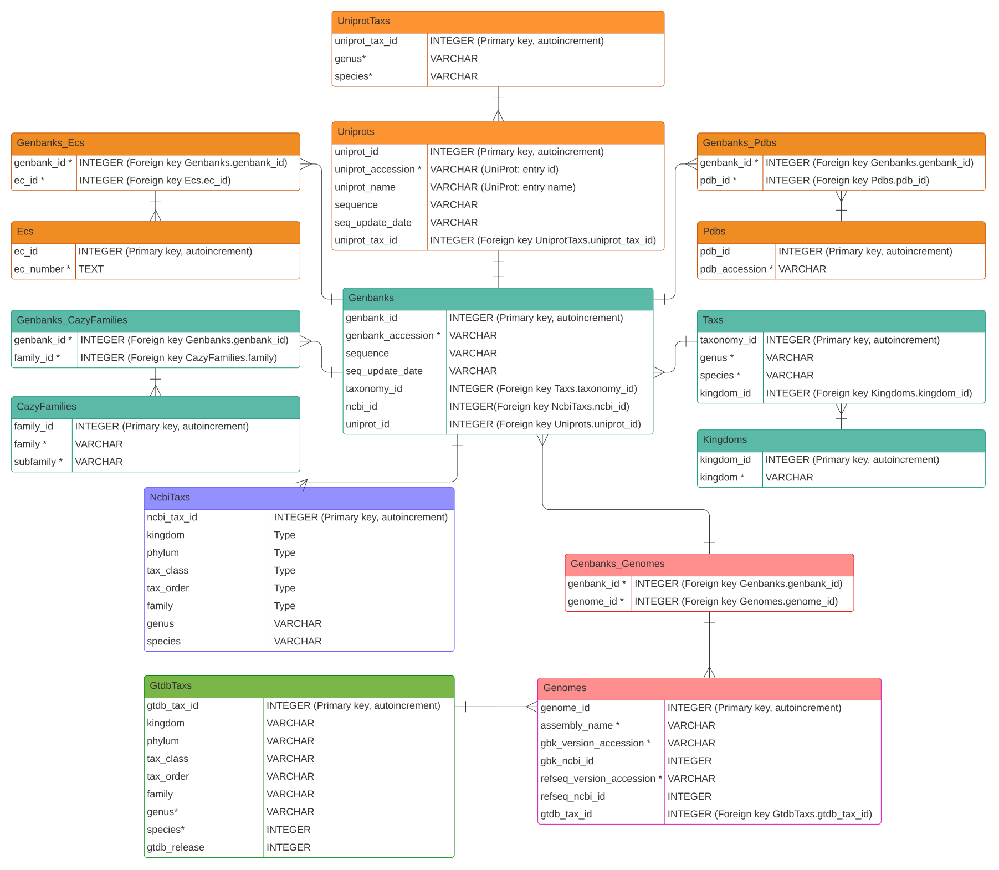

# cazy_webscraper

-------------------------------

[](https://doi.org/10.5281/zenodo.6343936)
[](https://github.com/HobnobMancer/cazy_webscraper/blob/master/LICENSE)  
[](https://circleci.com/gh/HobnobMancer/cazy_webscraper)
[](https://codecov.io/gh/HobnobMancer/cazy_webscraper)
[](https://cazy-webscraper.readthedocs.io/en/latest/?badge=latest)  
[](https://anaconda.org/bioconda/cazy_webscraper)
[](https://anaconda.org/bioconda/cazy_webscraper)  
[](https://pypi.python.org/pypi/cazy_webscraper)  
[](https://pepy.tech/project/cazy-webscraper)

--------------------------------

## cazy_webscraper

`cazy_webscraper` is an application and Python3 package for the automated retrieval of protein data from the [CAZy](http://wwww.cazy.org/) database. The code is distributed under the MIT license.
The full documentation can be found at [Read the Docs](https://cazy-webscraper.readthedocs.io/en/latest/?badge=latest).

**`cazy_webscraper` retrieves protein data from the [CAZy database](https://www.cazy.org) and stores the data in a local SQLite3 database.** This enables users to integrate the dataset into analytical pipelines, and interrogate the data in a manner unachievable through the CAZy website.

**Data can be retrieved for user defined datasets of interest.** `cazy_webscraper` can recover specified CAZy Classes and/or CAZy families. These queries can be filtered by taxonomy at Kingdoms, genus, species or strain level. Successive CAZy queries can be collated into a single local database. A log of each query is recorded in the database for transparency, reproducibility and shareablity.

**Using the `expand` subcommand, a user can expand the core dataset.** Specifically, `cazy_webscraper` can be used to retrieve data from the following external databases for CAZymes in the local CAZyme database that meet user specified criteria, and adds the downloaded data to the local CAZyme database:

**[GenBank](https://www.ncbi.nlm.nih.gov/genbank/):**  
- Protein sequences 
- Latest taxonomic classification - including complete lineage (including phylum, class, order and family) (version >=2.1.2)
- Latest genomic assembly data (GenBank and RefSeq (when available) version accession and ID numbers) (version >=2.1.3)

**[UniProt](https://www.uniprot.org/):** 
- UniProt ID/accession
- Protein name
- EC numbers
- PDB accessions
- Protein sequence (and date sequence was last updated)
- Taxonomic classification (genus and species)

**[Research Collaboratory for Structural Bioinformatics (RCSB) Protein Data Bank (PDB)](https://www.rcsb.org/):**
- Protein structure files
- *Structure files are written to disk, **not** stored in the local CAZyme database*

**[Genome Taxonomy Database (GTDB)](https://gtdb.ecogenomic.org/):**
Retrieve the latest archaeal and bacterial taxonomic classifications (including complete lineages from kingdom to species) - available in `cazy_webscraper` verion >= 2.2.0.

**`cazy_webscraper` faciltates extracting information from the local CAZyme database.**

Protein sequences (retrieved from GenBank and/or UniProt) from the local CAZyme database for CAZymes matching the user specified criteria, and write to:
- A single multisequence FASTA file
- A FASTA file per extracted protein sequence
- A local BLASTP database

**The `cazy_webscraper` API facilitates interoggating the local CAZyme database.**

Please see the [full documentation at ReadTheDocs](https://cazy-webscraper.readthedocs.io/en/latest/?badge=latest).

## Updates

**New in version 2.3.0**
* Downloading protein data from UniProt is several magnitudes faster than before - and should have fewer issues with using older version of `bioservices`
    - Uses `bioservices` mapping to map directly from NCBI protein version accession to UniProt
    - `cw_get_uniprot_data` not longer calls to NCBI and thus no longer requires an email address as a positional argument
* Updated database schema: Changed `Genbanks 1--* Uniprots` to `Genbanks *--1 Uniprots`. `Uniprots.uniprot_id` is now listed in the `Genbanks` table, instead of listing `Genbanks.genbank_id` in the `Uniprots` table

* Retrieve taxonomic classifications from UniProt
    * Use the `--taxonomy`/`-t` flag to retrieve the scientific name (genus and species) for proteins of interest
    * Adds downloaded taxonomic information to the `UniprotsTaxs` table

* Improved clarrification of deleting old records when using `cw_get_uniprot_data`
    - Separate arguments to delete Genbanks-EC number and Genbanks-PDB accession relationships that are no longer listed in UniProt for those proteins in the local CAZyme database for proteins whom data is downloaded from UniProt
    - New args:
        - `--delete_old_ec_relationships` = deletes Genbank(protein)-EC number relationships no longer in UniProt
        - `--delete_old_ecs` = deletes EC numbers in the local db not linked to any proteins
        - `--delete_old_pdb_relationships` = deletes Genbank(protein)-PDB relationships no longer in UniProt
        - `--delete_old_pdbs` = deletes PDB accessions in the local db not linked to any proteins

* Retrieve the local db schema
    - New command `cw_get_db_schema` added.
    - Retrieves the SQLite schema of a local CAZyme database and prints it to the terminal

* Added option to skip retrieving the latest taxonomic classifications NCBI taxonomies
    - By default, when retreiving data from CAZy, `cazy_webscraper` retrieves the latest taxonomic classifications for proteins listed under multiple tax
    - To increase scrapping time, and to reduce burden on the NCBI-Entrez server, if this data is not needed (e.g. GTDB taxs will be use) this step can be skipped by using the new `--skip_ncbi_tax` flag.
    - When skipping retrieval of the latest taxa classifications from NCBI, `cazy_webscraper` will add the first taxa retrieved from CAZy for those proteins listed under mutliple taxa


## Documentation

The full documentation can be found at [Read the Docs](https://cazy-webscraper.readthedocs.io/en/latest/?badge=latest).

### Our paper: Implementation and demonstration of use

For a full description of the operation and examples of use, please see our paper in (BioRxiv)[https://www.biorxiv.org/content/10.1101/2022.12.02.518825v1.full].

> Hobbs, E. E. M., Gloster, T. M., and Pritchard, L. (2022) 'cazy_webscraper: local compilation and interrogation of comprehensive CAZyme datasets', _bioRxiv_, [https://doi.org/10.1101/2022.12.02.518825](https://www.biorxiv.org/content/10.1101/2022.12.02.518825v1.full)

### Database structure

You can view the database schema [here](#database-schema) and find a PDF of the database schema [here](https://hobnobmancer.github.io/cazy_webscraper/database_schema.pdf).

## Contributions

We welcome contributions and suggestions. You can raise issues at this repository, or fork the repository and submit pull requests, at the links below:

- [Issues](https://github.com/HobnobMancer/cazy_webscraper/issues)
- [Pull Requests](https://github.com/HobnobMancer/cazy_webscraper/pulls)

## Table of Contents
<!-- TOC -->
- [`cazy_webscraper`](#cazy_webscraper)
- [Citation](#citation)
- [Best practice](#best-practice)
- [Documentation](#documentation)
    - [Installation](#installation)
    - [Quick start](#quick-start)
    - [Command summary](#command-summary)
- [Creating a local CAZyme database](#creating-a-local-cazyme-database)
    - [Combining configuration filters](#combining-configuration-filters)
    - [Default CAZy class synonyms](#default-cazy-class-synonyms)
- [Retrieve data from UniProt](#retrieve-data-from-uniprot)
    - [Configuring UniProt data retrieval](#configuring-uniprot-data-retrieval)
- [Retrieving protein sequences from GenBank](#retrieving-protein-sequences-from-genbank)
    - [Configuring GenBank protein sequence data retrieval](#configuring-genbank-protein-sequence-retrieval)
- [Extracting protein sequences from the local CAZyme database and building a BLAST database](#extracting-protein-sequences-from-the-local-cazyme-database-and-building-a-blast-database)
    - [Configuring extracting sequences from a local CAZyme db](#configuring-extracting-sequences-from-a-local-cazyme-db)
- [Retrieving protein structure files from PDB](#retrieving-protein-structure-files-from-pdb)
    - [Configuring PDB protein structure file retrieval](#configuring-pdb-protein-structure-file-retrieval)
- [Retrieving NCBI taxonomies](#retrieving-ncbi-taxonomies)
    - [Configuring retrieving NCBI taxonomies](#configuring-retrieving-ncbi-taxonomies)
- [Retrieving genomic assembly data from NCBI](#retrieving-genomic-assembly-data-from-ncbi)
    - [Configuring retrieving genomic assembly data](#configuring-retrieving-genomic-assembly-data)
- [Retrieving GTDB taxonomies](#retrieving-gtdb-taxonomies)
    - [Configuring retrieving GTDB taxonomies](#configuring-retrieving-gtdb-taxonomies)
- [The `cazy_webscraper` API or Interrogating the local CAZyme database](#the_cazy_webscraper_api_or_interrogating_the_local_cazyme_database)
- [Configuring `cazy_webscraper` using a YAML file](#configuring-using-a-yaml-file)
- [CAZy coverage of GenBank](#cazy-coverage-of-genbank)
    - [Configure calculating CAZy coverage of GenBank](#configure-calculating-cazy-coverage-of-genbank)
- [Integrating a local CAZyme database](#integrating-a-local-cazyme-database)
- [Database schema](#database-schema)
- [Contributions](#contributions)
- [License and copyright](#license-and-copyright)
<!-- /TOC -->


## Features in the pipeline:
- Retrieve and stored PubMed IDs in the local CAZyme database
- Fix any remaining bugs we can find (if you find a bug, please report it and provide as detailed bug report as possible!)
- Increase unit test coverage
- Automate analysing the taxonomic distribution across CAZy and datasets of interest, including generating a final report

## Citation

If you use `cazy_webscraper`, please cite the following publication:

> Hobbs, E. E. M., Gloster, T. M., and Pritchard, L. (2022) 'cazy_webscraper: local compilation and interrogation of comprehensive CAZyme datasets', _bioRxiv_, [https://doi.org/10.1101/2022.12.02.518825](https://www.biorxiv.org/content/10.1101/2022.12.02.518825v1)

cazy_webscraper depends on a number of tools. To recognise the contributions that the 
authors and developers have made, please also cite the following:

When making an SQLite database:
> Hipp, R. D. (2020) SQLite, available: https://www.sqlite.org/index.html.

Retrieving taxonomic, genomic or sequence data from NCBI:
> Cock, P.J.A., Antao, T., Chang, J.T., Chapman, B.A., Cox, C.J., Dalke, A., et al (2009) Biopython: freely available Python tools for computational molecular biology and bioinformatics, Bioinformatics, 25(11), 1422-1423.
> Wheeler,D.L., Benson,D.A., Bryant,S., Canese,K., Church,D.M., Edgar,R., Federhen,S., Helmberg,W., Kenton,D., Khovayko,O. et al (2005) Database resources of the National Centre for Biotechnology Information: Update, Nucleic Acid Research, 33, D39-D45

Retrieving data from UniProt:
> Cokelaer, T., Pultz, D., Harder, L. M., Serra-Musach, J., Saez-Rodriguez, J. (2013) BioServices: a common Python package to access biological Web Services programmatically, Bioinformatics, 19(24), 3241-3242.

Downloading protein structure files from RSCB PDB:
> Berman, H.M., Westbrook, J., Feng, Z., Gilliland, G., Bhat, T.N., Weissig, H., et al (2022) The Protein Data Bank, Nucleic Acids Research, 28(1), 235-242.
> Hamelryck, T., Manderick, B. (2003), PDB parser and structure class implemented in Python. Bioinformatics, 19 (17), 2308–2310

Retrieving and using taxonomic data from GTDB:
> Parks, D.H., Chuvochina, M., Rinke, C., Mussig, A.J., Chaumeil, P., Hugenholtz, P. (2022) GTDB: an ongoing census of bacterial and archaeal diversity through a phylogenetically consistent, rank normalized and complete genome-based taxonomy, Nucleic Acids Research, 50(D1), D785-D794.

## Best practice

When performing a series of many automated calls to a server it is best to do this when traffic is lowest, such as at weekends or overnight *at the server*.

## Documentation

Please see the [full documentation at ReadTheDocs](https://cazy-webscraper.readthedocs.io/en/latest/?badge=latest).

### Installation

`cazy_webscraper` can be installed via `conda` or `pip`:

```bash
conda install -c bioconda cazy_webscraper
```

Please see the [`conda` documentation](https://docs.conda.io/projects/conda/en/latest/user-guide/install/) and [`bioconda` documentation](https://bioconda.github.io/) for further details.

```bash
pip install cazy_webscraper
```

Please see the [`pip` documentation](https://pypi.org/project/pip/) for further details.

### Quickstart

We have produced a "Getting Started With `cazy_webscraper`" [poster](https://hobnobmancer.github.io/cazy_webscraper/getting_started_cazy_webscraper_v2.pdf).

To download all of CAZy and save the database in the default location (the cwd) with the default name (`cazy_webscraper_<date>_<time>.db`) use the following command:  
```bash
cazy_webscraper <user_email>
```

### Version and citation

To retrieve the version, use the following command:

```bash
cazy_webscraper -V
```
or
```bash
cazy_webscraper --version
```

To retrieve the citation to use:

```bash
cazy_webscraper -C
```
or
```bash
cazy_webscraper --citation
```

### Command summary

Below are the list of commands (excluding required and optional arguments) included in `cazy_webscraper`.

#### CAZy

To retrieve data from CAZy and compile and SQLite database using `cazy_webscraper` command.

#### UniProt

To retrieve protein data from UniProt, use the `cw_get_uniprot_data` command.

The following data can be retrieved:
- UniProt accession
- Protein name
- EC numbers
- PDB accession
- Protein sequences

#### GenBank

To retrieve protein sequences from GenBank use the `cw_get_genbank_seqs` command.

#### Extract sequences

To extract GenBank and/or UniProt protein sequences from a local CAZyme database, use the `cw_extract_db_seqs` command.

#### PDB

To protein structure files from PDB use the `cw_get_pdb_structures` command.

**Note:** PDB structure files are retrieved for the PDB accessions that are *in* a local CAZyme database created using `cazy_webscraper`. A freshly built CAZyme database only contains NCBI protein accessions, taxonomic kingdoms, source organisms, and CAZy family annotations. Therefore, the `cw_get_uniprot_data` command must be used to retrieve PDB accessions from the UniProt database **prior** to using the `cw_get_pdb_structures` command.

#### Interrogate the database

To interrogate the database, use the `cw_query_database` command.

### Local CAZyme database schema

The schema of a local CAZyme database can be retrieved using `cazy_webscraper`:

```bash
cw_get_db_schema <path to local CAZyme database>
```

Alternatively, `sqlite3` can be used to retrieve the schema:
```bash
sqlite3 <path to local CAZyme database> .schema
```

A visual representation of the db schema when using `cazy_webscraper` version >= 2.3.0 can be found [here](https://hobnobmancer.github.io/cazy_webscraper/database_schema.pdf).

## Creating a local CAZyme database
Command line options for `cazy_webscraper`, which is used to scrape CAZy and compile a local SQLite database. 
Options are written in alphabetical order.

`email` - \[REQUIRED\] User email address. This is required by NCBI Entrez for querying the Entrez server.
**Email address is not required when printing out the citation and version number information**

`--cache_dir` - Path to cache dir to be used instead of default cache dir path.

`--cazy_data` - Path to a txt file downloaded from CAZy containing a CAZy db data dump.

`--cazy_synonyms` - Path to a JSON file containing accepted CAZy class synonsyms if the default are not sufficient.

`--classes` - list of classes from which all families are to be scrape.

`--config`, `-c` - Path to a configuration YAML file. Default: None.

`--citation`, `-C` - Print the `cazy_webscraper` citation. When called, the program terminates after printng the citation and CAZy is **not** scraped.

`--db_output`, `-o` - Path to write out a **new** local CAZyme database.

`--database`, `-d` - Path to an **existings** local CAZyme database to add newly scraped too. Default: None.

_Do not use `--db_output` **and** `--database` at the same time._

_If `--db_output` **and** `--database` are **not** called, `cazy_webscraper` writes out a local CAZyme database to the cwd with the standardised name `cazy_webscraper_<date>_<time>.db`_

`--delete_old_relationships` - Detele old CAZy family annotations of GenBank accessions. These are CAZy family annotations of a given GenBank accession are in the local database but the accession is not longer associated with those CAZy families, so delete old accession-family relationships.

`--families` - List of CAZy (sub)families to scrape.

`--force`, `-f` - force overwriting existing output file. Default: False.

`--genera` - List of genera to restrict the scrape to. Default: None, filter not applied to scrape.

`--kingdoms` - List of taxonomic kingdoms to restrict the scrape to. Default: None, filter is not applied.

`--log`, `-l` - Target path to write out a log file. If not called, no log file is written. Default: None (no log file is written out).

`--nodelete`, `-n` - When called content in an existing output directory is not deleted.

__When the `--db_output` flag is used, `cazy_webscraper` will create any necessary parent directories. If the direct/immediate parent directory of the database exists, by default `cazy_webscraper` will delete the content in this parent directory._

`--ncbi_batch_size` - The number of protein IDs submitted per batch to NCBI, when retrieving taxonomic classifications. Default 200.

`--nodelete_cache` - When called, content in the existing cache dir will **not** be deleted. Default: False (existing content is deleted).

`--nodelete_log` - When called, content in the existing log dir will **not** be deleted. Default: False (existing content is deleted).

`--retries`, `-r` - Define the number of times to retry making a connection to CAZy if the connection should fail. Default: 10.

`--skip-ncbi_tax` - Skip retrieving the latest taxonomic information for NCBI were multiple taxonomic classifications are retrieved from CAZy for a protein. The first taxonomy retrieved from CAZy will be added to the local CAZyme database. Default False - the first taxon listed for each protein is added to the local CAZyme database.

`--sql_echo` - Set SQLite engine echo parameter to True, causing SQLite to print log messages. Default: False.

`--subfamilies`, `-s` - Enable retrival of CAZy subfamilies, otherwise **only** CAZy family annotations will be retrieved. Default: False.

`--species` - List of species written as Genus Species) to restrict the scraping of CAZymes to. CAZymes will be retrieved for **all** strains of each given species.

`--strains` - List of specific species strains to restrict the scraping of CAZymes to.

`--timeout`, `-t` - Connection timout limit (seconds). Default: 45.

`--validate`, - Retrieve CAZy family population sizes from the CAZy website and check against the number of family members added to the local CAZyme database, as a method for validating the complete retrieval of CAZy data.

`--verbose`, `-v` - Enable verbose logging. This does not set the SQLite engine `echo` parameter to True. Default: False.

`--version`, `-V` - Print `cazy_webscraper` version number. When called and the version number is printed, `cazy_webscraper` is immediately terminated.

### Combining configuration filters

`cazy_webscraper` applies filters in a successive and layered structure.

CAZy class and family filters are applied first.

Kingdom filters are applied second.

Lastly, taxonomy (genus, species and strain) filters are applied.

### Default CAZy class synonyms

CAZy classes are accepted in the written long form (such as Glycoside Hydrolases) and in their abbreviated form (e.g. GH).

Both the plural and singular abbreviated form of a CAZy class name is accepted, e.g. GH and GHs.

Spaces, hythens, underscores and no space or extract character can be used in the CAZy class names. Therefore, Glycoside Hydrolases, Glycoside-Hydrolases, Glycoside_Hydrolases and GlycosideHydrolases are all accepted.

Class names can be written in all upper case, all lower case, or mixed case, such as GLYCOSIDE-HYDROLASES, glycoside hydrolases and Glycoside Hydrolases. All lower or all upper case CAZy class name abbreviations (such as GH and gh) are accepted.

## Retrieve data from UniProt

[UniProtKB] is one of the largest protein database, incorporating data from the [PDB] structure database, NCBI and other protein annotation databases.

`cazy_webscraper` can retrieve protein data from UniProt for proteins catalogued in a local CAZyme database created using `cazy_webscraper`. Specifically, for each protein, `cazy_webscraper` can retrieve:
- The UniProt accession
- Protein name
- PDB accessions of associated structure files from the PDB database
- EC number annnotations
- Protein sequence from the UniProt

`cazy_webscraper` always retrieves the UniProt accession and protein name, but the retrieval of PDB accession, EC numbers and protein sequences is optional.

Data can be retrieived for all proteins in the local CAZyme database, or a specific subset. CAZy class, CAZy family, genus, species, strains, kingdom and EC number filters can be defined in order to define a dataset to retrieve protein data for.

To retrieve all UniProt data for all proteins in a local CAZyme datbase, using the following command:
```bash
cw_get_uniprot_data <path_to_local_CAZyme_db> --ec --pdb --sequence
```

### Configuring UniProt data retrieval

Below are listed the command-line flags for configuring the retrieval of UniProt data.

`database` - \[REQUIRED\] Path to a local CAZyme database to add UniProt data to.

`--bioservices_batch_size` - Change the query batch size submitted via [`bioservices`](https://bioservices.readthedocs.io/en/master/) to UniProt to retrieve protein data. Default is 1000. See the [UniProt REST API documentation](https://www.uniprot.org/help/id_mapping) for batch size limits.

`--cache_dir` - Path to cache dir to be used instead of default cache dir path.

`--cazy_synonyms` - Path to a JSON file containing accepted CAZy class synonsyms if the default are not sufficient.

`--classes` - List of classes to retrieve UniProt data for.

`--config`, `-c` - Path to a configuration YAML file. Default: None.

`--ec`, `-e` - Enable retrieval of EC number annotations from UniProt

`--ec_filter` - Limist retrieval of protein data to proteins annotated with a provided list of EC numbers. Separate the EC numbers bu single commas without spaces. Recommend to wrap the entire str in quotation marks, for example:
```bash
cw_get_uniprot_data my_cazyme_db/cazyme_db.db --ec_filter 'EC1.2.3.4,EC2.3.1.-'
```

`--families` - List of CAZy (sub)families to scrape.

`--force` - Force writing in existing cache directory.

`--genbank_accessions` - Path to text file containing a list of GenBank accessions to retrieve protein data for. A unique accession per line.

`--genera` - List of genera to restrict the scrape to. Default: None, filter not applied to scrape.

`--kingdoms` - List of taxonomic kingdoms to restrict the scrape to. Default: None, filter is not applied.

`--log`, `-l` - Target path to write out a log file. If not called, no log file is written. Default: None (no log file is written out).

`--name_update` - Boolean, whether to overwrite the existing protein name (previously retrieved from UniProt). Default: do not update.

`--nodelete_cache` - When called, content in the existing cache dir will **not** be deleted. Default: False (existing content is deleted).

`--nodelete_log` - When called, content in the existing log dir will **not** be deleted. Default: False (existing content is deleted).

`--pdb`, `-p` - Enable retrieval of PDB accessions. Default, PDB accessions not retrieved.

`--retries`, `-r` - Define the number of times to retry making a connection to CAZy if the connection should fail. Default: 10.

`--delete_old_ec_relationships` - Boolean, delete old Genbanks-EC number relationships - For those proteins in the local db for whom data is downloaded from UniProt, compare the current links between the proteins in the Genbanks table and EC numbers in the Ecs table. Delete Genbanks-Ecs relationships that are not longer listed in the respective protein records in UniProt.

`--delete_old_ecs` - Boolean, delete EC number - Delete EC numbers that are not linked to any proteins listed in the Genbanks table. These can arise from multiple retrievals of data from the UniProt data over a period of time during UniProt records have been updated.

`--delete_old_pdb_relationships` - Boolean, delete old Genbanks-PDB relationships - For those proteins in the local db for whom data is downloaded from UniProt, compare the current links between the proteins in the Genbanks table and PDB accessions in the Pdbs table. Delete Genbanks-Pdbs relationships that are not longer listed in the respective protein records in UniProt.

`--delete_old_pdbs` - Boolean, delete PDB accessions - Protein relationships that are no longer listed in UniProt, i.e. an PDB accessions that are no longer included in UniProt but is in the local database. If set to TRUE these relationships will be DELETED from the database.

`--use_uniprot_cache` - Path to a JSON file, keyed by UniProt accessions/IDs and valued by dicts containing `{'gbk_acc': str, 'db_id': int}`. This file part of the cache created by `cw_get_uniprot_data`. This is option to skip retrieving the UniProt IDs for a set of GenBank accessions, if retrieving data for the same dataset (this save a lot of time!)

`skip_download` - Bool, default False. If set to True, only uses data from UniProt cache and will not download new data from UniProt.

`--sequence`, `-s` - Retrieve protein amino acid sequences from UniProt

`--sql_echo` - Set SQLite engine echo parameter to True, causing SQLite to print log messages. Default: False.

`--species` - List of species written as Genus Species) to restrict the scraping of CAZymes to. CAZymes will be retrieved for **all** strains of each given species.

`--strains` - List of specific species strains to restrict the scraping of CAZymes to.

`--taxonomy`, `-t` - Retrieve taxonomic classifications (genus species) and add to the local CAZyme database

`--timeout` - Connection timout limit (seconds). Default: 45.

`--update_name` - If a newer version of the protein name is available, overwrite the existing name for the protein in the database. Default is false, the protein name is **not** overwritten and updated.

`--update_seq` - If a newer version of the protein sequence is available, overwrite the existing sequence for the protein in the database. Default is false, the protein sequence is **not** overwritten and updated.

`--use_uniprot_cache` - Path to JSON file containing data previosuly retrieved from UniProt by `cazy_webscraper`, use if an error occurred while adding the data to the local CAZyme database. This will skip the retrieval of data from UniProt, and the cached data will be added to the local CAZyme database. This can also be shared with others to add the same data to their local CAZyme database.

`--uniprot_batch_size` - Size of an individual batch query submitted to the [UniProt REST API](https://www.uniprot.org/help/programmatic_access) to retrieve the UniProt accessions of proteins identified by the GenBank accession. Default is 150. The UniProt API documentation recommands batch sizes of less than 20,000 but batch sizes of 1,000 often result in HTTP 400 errors. It is recommend to keep batch sizes less than 1,000, and ideally less than 200.

`--verbose`, `-v` - Enable verbose logging. This does not set the SQLite engine `echo` parameter to True. Default: False.

**UniProt batch sizes:**
Note that according to Uniprot (June 2022), there are various limits on ID Mapping Job Submission:

========= =====================================================================================
Limit	  Details
========= =====================================================================================
100,000	  Total number of ids allowed in comma separated param ids in /idmapping/run api
500,000	  Total number of "mapped to" ids allowed
100,000	  Total number of "mapped to" ids allowed to be enriched by UniProt data
10,000	  Total number of "mapped to" ids allowed with filtering
========= =====================================================================================

### UniProt data retrieval cache

- The tables retrieved from UniProt are converted to dataframes, and written out as CSV files in the cache directory
- The parsed UniProt data as a single JSON file

## Retrieveing protein seqences from GenBank

Protein amino acid sequences can be retrieved for proteins in a local CAZyme database using `cazy_webscraper`. Protein sequences can be retrieved for a specific subset of proteins, identified through the use of CAZy class, CAZy family, taxonomy (kingdom, genus, species and strain) filters, and EC number filters. The retrieved protein sequences are written to the local CAZyme database.

_Extracting protein sequences from the local CAZyme database and writing them to a BLAST database and/or FASTA file(s) is covered in the next section._

To retrieve all GenBank protein seuqneces for all proteins in a local CAZyme datbase, using the following command:
```bash
cw_get_genbank_seqs <path_to_local_CAZyme_db>
```

### Configuring GenBank protein sequence retrieval

Below are listed the command-line flags for configuring the retrieval of protein sequences from GenBank.

`database` - \[REQUIRED\] Path to a local CAZyme database to add UniProt data to.

`email` - \[REQUIRED\] User email address, required by NCBI Entrez.

`--batch_size` - Size of batch query posted to NCBI Entrez. Default 150.

`--cache_dir` - Path to cache dir to be used instead of default cache dir path.

`--cazy_synonyms` - Path to a JSON file containing accepted CAZy class synonsyms if the default are not sufficient.

`--config`, `-c` - Path to a configuration YAML file. Default: None.

`--classes` - List of classes from which all families are to be scrape.

`--ec_filter` - Limist retrieval of protein data to proteins annotated with a provided list of EC numbers. Separate the EC numbers bu single commas without spaces. Recommend to wrap the entire str in quotation marks, for example:
```bash
cw_get_uniprot_data my_cazyme_db/cazyme_db.db --ec_filter 'EC1.2.3.4,EC2.3.1.-'
```

`--force`, `-f` - Force writing cachce to exiting cache directory.

`--families` - List of CAZy (sub)families to scrape.#

`--kingdoms` - List of taxonomy kingdoms to retrieve UniProt data for.

`--genbank_accessions` - Path to text file containing a list of GenBank accessions to retrieve protein data for. A unique accession per line.

`--genera` - List of genera to restrict the scrape to. Default: None, filter not applied to scrape.

`--log`, `-l` - Target path to write out a log file. If not called, no log file is written. Default: None (no log file is written out).

`--nodelete_cache` - When called, content in the existing cache dir will **not** be deleted. Default: False (existing content is deleted).

`--retries`, `-r` - Define the number of times to retry making a connection to CAZy if the connection should fail. Default: 10.

`--seq_dict`, - Path to a JSON file, keyed by GenBank accessions and valued by protein sequence. This file is created as part of the cache, after all protein sequences are retrieved from GenBank.

`--seq_update` - If a newer version of the protein sequence is available, overwrite the existing sequence for the protein in the database. Default is false, the protein sequence is **not** overwritten and updated. This skips the retrieval of the protein sequences from GenBank.

`--sql_echo` - Set SQLite engine echo parameter to True, causing SQLite to print log messages. Default: False.

`--species` - List of species written as Genus Species) to restrict the scraping of CAZymes to. CAZymes will be retrieved for **all** strains of each given species.

`--strains` - List of specific species strains to restrict the scraping of CAZymes to.

`--verbose`, `-v` - Enable verbose logging. This does not set the SQLite engine `echo` parameter to True. Default: False.

### GenBank sequence retrieval cache

`cazy_webscraper` produces three cache files, which are written to the cache dir:
1. `no_seq_retrieved.txt` which lists the GenBank accessions for which no sequence could be retrieved from GenBank
2. `seq_retrieved.txt` which list GenBank accessiosn for which a sequence was retrieved from GenBank
3. JSON file keyed by GenBank accessions and valued by the retrieved protein sequence

## Extracting protein sequences from the local CAZyme database and building a BLAST database

Protein sequences from GenBank and UniProt that are stored in the local CAZyme database can be extracted using `cazy_webscraper`, and written to any combination of:
- 1 FASTA file per unique protein
- A single FASTA file containing all extracted seqences
- A BLAST database

**FASTA file format:** Protein sequences extracted from a local CAZyme database are written out with the GenBank/UniProt accession as the protein ID, and the name of the source database ('GenBank' or 'UniProt') as the description.

To extract all protein seqeunces from the local CAZyme database using the following command structure:
```bash
cw_extract_db_seqs <path_to_local_CAZyme_db> genbank uniprot
```

To retrieve protein sequences from GenBank or UniProt, name only the respective database. For example, to retrieve only 
GenBank proteins:
```bash
cw_extract_db_seqs <path_to_local_CAZyme_db> genbank
```


### Configuring extracting sequences from a local CAZyme db

Below are listed the command-line flags for configuring the extraction of protein sequences from the local CAZyme db.

`database` - \[REQUIRED\] Path to a local CAZyme database to add UniProt data to.

`source` - \[REQUIRED\] Define source databases of protein sequences. Accepts 'genbank' and 'uniprot'. To list both, separate with a single space (' ')
```bash
cw_extract_sequence cazy_database.db genbank uniprot
```
*The database names are not case sensitive, therefore, both GenBank and genbank are accepted.* 

`-b`, `--blastdb` - Create BLAST database of extracted protein sequences. Provide the path to the directory to store the BLAST database in.

`--fasta_dir` - Write out each extracted sequence to a separate FASTA file in the provided dir. Provide a path to a directory to write out the FASTA files.

`--fasta_file` - Write out all extracted sequences to a single FASTA file. Provide a path to write out the FASTA file.

_Note: at least one of `--blastdb`, `--fasta_dir`, and `--fasta_file` must be called to inform `cazy_webscraper` where to write the output to. If none are called sequences will be extracted._

`--cache_dir` - Path to cache dir to be used instead of default cache dir path.

`--cazy_synonyms` - Path to a JSON file containing accepted CAZy class synonsyms if the default are not sufficient.

`--config`, `-c` - Path to a configuration YAML file. Default: None.

`--classes` - List of classes from which all families are to be scrape.

`--ec_filter` - Limist retrieval of protein data to proteins annotated with a provided list of EC numbers. Separate the EC numbers bu single commas without spaces. Recommend to wrap the entire str in quotation marks, for example:
```bash
cw_get_uniprot_data my_cazyme_db/cazyme_db.db --ec_filter 'EC1.2.3.4,EC2.3.1.-'
```

`--force`, `-f` - Force overwriting exsiting files and writing to existing output directory.

`--families` - List of CAZy (sub)families to scrape.#

`--kingdoms` - List of taxonomy kingdoms to retrieve UniProt data for.

`--genbank_accessions` - Path to text file containing a list of GenBank accessions to retrieve protein data for. A unique accession per line.

`--genera` - List of genera to restrict the scrape to. Default: None, filter not applied to scrape.

`--log`, `-l` - Target path to write out a log file. If not called, no log file is written. Default: None (no log file is written out).

`--nodelete` - When called, content in the existing output dir will **not** be deleted. Default: False (existing content is deleted).

`--nodelete_cache` - When called, content in the existing cache dir will **not** be deleted. Default: False (existing content is deleted).

`--sql_echo` - Set SQLite engine echo parameter to True, causing SQLite to print log messages. Default: False.

`--species` - List of species written as Genus Species) to restrict the scraping of CAZymes to. CAZymes will be retrieved for **all** strains of each given species.

`--strains` - List of specific species strains to restrict the scraping of CAZymes to.

`--uniprot_accessions` - Path to text file containing a list of UniProt accessions to retrieve protein data for. A unique accession per line.

`--verbose`, `-v` - Enable verbose logging. This does not set the SQLite engine `echo` parameter to True. Default: False.


## Retrieving protein structure files from PDB

`cazy_webscraper` can retrieve protein structure files for proteins catalogued in a local CAZyme database. Structure files can be retrieved for all proteins in the database or a subset of proteins, chosen by defining CAZy class, CAZy family, taxonomy (kingdom, genus, species and strain) filters, and EC number filters.

Retrieval of structure files from PDB is performed by the `BioPython` module `PDB` [Cock _et al._, 2009], which writes the downloaded structure files to the local disk. Therefore, the downloaded structure files are **not** stored in the local CAZyme database at the present.

> Cock, P. J. A, Antao, T., Chang, J. T., Chapman, B. A., Cox, C. J., Dalke, A. _et al._ (2009) 'Biopython: freely available Python tools for computaitonal molecular biology and bioinformatics', _Bioinformatics_, 25(11), pp. 1422-3.

To retrieve structure files for all proteins in a local CAZyme database in `mmCif` and `pdb` format, use the following command:
```bash
cw_get_pdb_structures <path_to_local_CAZyme_db> mmcif,pdb
```

Protein structure files can be retrieved in a variety of formats, including:

- mmCif (default, PDBx/mmCif file),
- pdb (format PDB),
- xml (PDBML/XML format),
- mmtf (highly compressed),
- bundle (PDB formatted archive for large structure}

### Configuring PDB protein structure file retrieval

Below are listed the command-line flags for configuring the retrieval of protein structure files from PDB.

`database` - \[REQUIRED\] Path to a local CAZyme database to add UniProt data to.

`pdb` \[REQUIRED\] The file types to be retrieved from PDB. The following file types are supported:  
- `mmCif`
- `pdb`
- `xml`
- `mmft`
- `bundle`
To chose multiple file types, list all desired file types, separting the files using a single space (' '). For example:
```bash
cw_get_genbank_seq my_cazyme_db/cazyme_db.db mmcif pdb xml
```
Providing the file types **is** case sensitive, but the order the file types are listed does **not** matter.

`--batch_size` - Size of an individual batch query of PDB accessions submitted to PDB. Default is 150.

`--cache_dir` - Path to cache dir to be used instead of default cache dir path.

`--cazy_synonyms` - Path to a JSON file containing accepted CAZy class synonsyms if the default are not sufficient.

`--config`, `-c` - Path to a configuration YAML file. Default: None.

`--classes` - List of classes from which all families are to be scrape.

`--ec_filter` - Limist retrieval of protein data to proteins annotated with a provided list of EC numbers. Separate the EC numbers bu single commas without spaces. Recommend to wrap the entire str in quotation marks, for example:
```bash
cw_get_uniprot_data my_cazyme_db/cazyme_db.db --ec_filter 'EC1.2.3.4,EC2.3.1.-'
```

`-F`, `--file_only` - Only add seqs provided via JSON and/or FASTA file. Do not retrieved data from NCBI.

`--families` - List of CAZy (sub)families to scrape.

`--genbank_accessions` - Path to text file containing a list of GenBank accessions to retrieve protein data for. A unique accession per line.

`--genera` - List of genera to restrict the scrape to. Default: None, filter not applied to scrape.

`--kingdoms` - List of taxonomy kingdoms to retrieve UniProt data for.

`--log`, `-l` - Target path to write out a log file. If not called, no log file is written. Default: None (no log file is written out).

`--nodelete` - When called, content in the existing output dir will **not** be deleted. Default: False (existing content is deleted).

`--nodelete_cache` - When called, content in the existing cache dir will **not** be deleted. Default: False (existing content is deleted).

`--outdir`, `-o` - Output directory to write out downloaded protein structure files to. Default is to write out the downloaded structure files to the current working directory.

`--overwrite` - Overwrite existing structure files with the same PDB accession as files being downloaded. Default false, do not overwrite existing files.

`--retries`, `-r` - Define the number of times to retry making a connection to CAZy if the connection should fail. Default: 10.

`--seq_dict` - Path to a JSON file, keyed by GenBank accessions and valued by protein sequence. Add seqs in file to the local CAZyme database.

`--seq_file` - Path to a FASTA file, keyed by GenBank accessions and valued by protein sequence. Add seqs in file to the local CAZyme database.

`--sql_echo` - Set SQLite engine echo parameter to True, causing SQLite to print log messages. Default: False.

`--species` - List of species written as Genus Species) to restrict the scraping of CAZymes to. CAZymes will be retrieved for **all** strains of each given species.

`--strains` - List of specific species strains to restrict the scraping of CAZymes to.

`--timeout`, `-t` - Connection timout limit (seconds). Default: 45.

`--uniprot_accessions` - Path to text file containing a list of UniProt accessions to retrieve protein data for. A unique accession per line.

`--verbose`, `-v` - Enable verbose logging. This does not set the SQLite engine `echo` parameter to True. Default: False.


## Retrieving NCBI taxonomies

Taxonomic opinions frequently change, and CAZy can fall out of sync with the latest taxonomic classifications with NCBI. To maintain an updated CAZyme database, `cazy_webscraper` can be used to retrieve the latest taxonomic classifications from NCBI for CAZymes in a local CAZyme database that meet the user's specified criteria. The downloaded taxonomic data is added to the local CAZyme database.

The complete lineage data is retrieved from NCBI. Whereas CAZy lists only the kingdom, genus, species and strain, `cazy_webscraper` retrieves the full taxonomic lineage from NCBI and stores the complete lineage in the `NcbiTaxs` table in the local CAZyme database. This include:
- Kingdom
- Phylum
- Class (stored as `tax_class` in the local CAZyme database due to keyword classes in Python)
- Order(stored as `tax_order` in the local CAZyme database due to keyword classes in SQL)
- Family
- Genus
- Species
- Strain

The command for retrieving the latest taxonomic classifications from the NCBI Taxonomy database using `cazy_webscraper` is `cw_get_ncbi_taxs`.

### Configuring retrieving NCBI taxonomies

Below are listed the command-line flags for configuring the retrieval of taxonomic classifications from the NCBI Taxonomy database, and adding them to the local CAZyme database.

`database` - \[REQUIRED\] Path to a local CAZyme database to add UniProt data to.

`email` - \[REQUIRED\] User email address (required by Entrez)

`--batch_size` - Size of an individual batch query of NCBI sequence version accessions to NCBI. Default is 150.

`--cache_dir` - Path to cache dir to be used instead of default cache dir path.

`--cazy_synonyms` - Path to a JSON file containing accepted CAZy class synonsyms if the default are not sufficient.

`--config`, `-c` - Path to a configuration YAML file. Default: None.

`--classes` - List of classes from which all families are to be scrape.

`--ec_filter` - Limist retrieval of protein data to proteins annotated with a provided list of EC numbers. Separate the EC numbers bu single commas without spaces. Recommend to wrap the entire str in quotation marks, for example:
```bash
cw_get_uniprot_data my_cazyme_db/cazyme_db.db --ec_filter 'EC1.2.3.4,EC2.3.1.-'
```

`--families` - List of CAZy (sub)families to scrape.

`--force` - Force writing to exiting cache directory.

`--genbank_accessions` - Path to text file containing a list of GenBank accessions to retrieve protein data for. A unique accession per line.

`--genera` - List of genera to restrict the scrape to. Default: None, filter not applied to scrape.

`--kingdoms` - List of taxonomy kingdoms to retrieve UniProt data for.

`--log`, `-l` - Target path to write out a log file. If not called, no log file is written. Default: None (no log file is written out).

`--nodelete_cache` - When called, content in the existing cache dir will **not** be deleted. Default: False (existing content is deleted).

`--retries`, `-r` - Define the number of times to retry making a connection to NCBI if the connection should fail. Default: 10.

`--sql_echo` - Set SQLite engine echo parameter to True, causing SQLite to print log messages. Default: False.

`--species` - List of species written as Genus Species) to restrict the scraping of CAZymes to. CAZymes will be retrieved for **all** strains of each given species.

`--strains` - List of specific species strains to restrict the scraping of CAZymes to.

`--uniprot_accessions` - Path to text file containing a list of UniProt accessions to retrieve protein data for. A unique accession per line.

`--update_gbk` - Update the existing NCBI taxonomy data in records in the `Genbanks` table already with NCBI taxonomy data. By default, NCBI tax data is only added to records in the `Genbanks` table if NCBI taxonomy data is not already presented in the record.

`--update_taxs` - Update existing NCBI taxonomy data in the `NcbiTaxs` table. By default onlt add new NCBI taxonomy data, do not update (and thus overwrite) existing data.

`--use_lineage_cache` - Use cached lineage data previously compliled by `cazy_webscraper` - skips retrieving NCBI Tax and Protein IDs and lineage data from NCBI

`--use_protein_ids` - Path to plain text file containing a tab delimited list of (1) NCBI Protein ID and (2) NCBI sequence version accession. Used cached NCBI Protein IDs.

`--use_tax_ids` - Path to plain text file listing a unique NCBI Taxonomy ID per line. Get lineages for cached NCBI Tax IDs.

`--verbose`, `-v` - Enable verbose logging. This does not set the SQLite engine `echo` parameter to True. Default: False.


## Retrieving genomic assembly data from NCBI

CAZy does not list the source genomic assembly for proteins catalogued in its database. `cazy_webscraper` can be used to retrieve the latest genomic assembly data from NCBI for CAZymes in 
a local CAZyme database that meet the user's specified criteria. The downloaded assembly data is added 
to the local CAZyme database entails:
- Assembly name
- GenBank genomic version accession
- GenBank genomic ID
- RefSeq genomic version accession
- RefSeq genomic ID

The command for retrieving genomic assembly data from the NCBI Assembly database using cazy_webscraper is `cw_get_genomics`.

### Configuring retrieving genomic assembly data

Below are listed the command-line flags for configuring the retrieval of genomic assembly data from the NCBI Assembly database, and adding the data to the local CAZyme database.

`database` - \[REQUIRED\] Path to a local CAZyme database to add UniProt data to.

`email` - \[REQUIRED\] User email address (required by Entrez)

`--batch_size` - Size of an individual batch query of NCBI sequence version accessions to NCBI. Default is 150.

`--cache_dir` - Path to cache dir to be used instead of default cache dir path.

`--cazy_synonyms` - Path to a JSON file containing accepted CAZy class synonsyms if the default are not sufficient.

`--config`, `-c` - Path to a configuration YAML file. Default: None.

`--classes` - List of classes from which all families are to be scrape.

`--ec_filter` - Limist retrieval of protein data to proteins annotated with a provided list of EC numbers. Separate the EC numbers bu single commas without spaces. Recommend to wrap the entire str in quotation marks, for example:
```bash
cw_get_uniprot_data my_cazyme_db/cazyme_db.db --ec_filter 'EC1.2.3.4,EC2.3.1.-'
```

`--families` - List of CAZy (sub)families to scrape.

`--force` - Force writing to exiting cache directory.

`--genbank_accessions` - Path to text file containing a list of GenBank accessions to retrieve protein data for. A unique accession per line.

`--genera` - List of genera to restrict the scrape to. Default: None, filter not applied to scrape.

`--kingdoms` - List of taxonomy kingdoms to retrieve UniProt data for.

`--log`, `-l` - Target path to write out a log file. If not called, no log file is written. Default: None (no log file is written out).

`--nodelete_cache` - When called, content in the existing cache dir will **not** be deleted. Default: False (existing content is deleted).

`--retries`, `-r` - Define the number of times to retry making a connection to NCBI if the connection should fail. Default: 10.

`--sql_echo` - Set SQLite engine echo parameter to True, causing SQLite to print log messages. Default: False.

`--species` - List of species written as Genus Species) to restrict the scraping of CAZymes to. CAZymes will be retrieved for **all** strains of each given species.

`--strains` - List of specific species strains to restrict the scraping of CAZymes to.

`--timeout` - Connection timeout threshold (s). (Default: 45s).

`--uniprot_accessions` - Path to text file containing a list of UniProt accessions to retrieve protein data for. A unique accession per line.

`--update` - Update assembly data in the database. Warning: updating records will overwrite existing data in the database. (Default: False, data is not updated).

`--verbose`, `-v` - Enable verbose logging. This does not set the SQLite engine `echo` parameter to True. Default: False.

## Retrieving GTDB Taxonomies

`cazy_webscraper` can be used to retrieve the latest taxonomic classification from the [Genome Taxonomy Database (GTDB)](https://gtdb.ecogenomic.org/) taxonomy database for a set of proteins of interest in a local CAZyme database.

**Note:**
    As in the GTDB database, GTDB taxonomic classifications are retrieved and associated with genomes stored 
    in the local CAZyme database. To retrieve GTDB taxonomic classifications the genomic data for the 
    proteins of interest **must** be listed in the local CAZyme database.

GTDB catalogues archaeal and bacterial lineages. Either archaeal and/or bacterial GTDB lineages can be added to the local CAZyme database.

The complete lineage data is retrieved from GTDB. Whereas CAZy lists only the kingdom, genus, species and strain, `cazy_webscraper` retrieves the full taxonomic lineage from GTDB and stores the complete lineage in the `GtdbTaxs` table in the local CAZyme database. This include:
- Kingdom
- Phylum
- Class (stored as `tax_class` in the local CAZyme database due to keyword classes in Python)
- Order(stored as `tax_order` in the local CAZyme database due to keyword classes in SQL)
- Family
- Genus
- Species
- Strain
- Release (the GTDB release from which the lineage was retrieved)

The command for retrieving the latest taxonomic classifications from the NCBI Taxonomy database using `cazy_webscraper` is `cw_get_gtdb_taxs`.

### Configuring retrieving GTDB taxonomies


`database` - **REQUIRED** Path to a local CAZyme database to add UniProt data to.

`taxs` - **REQUIRED** Kingdoms to get lineages from. Accepts 'archaea' and/or 'bacteria'. Separate with a single space. Order does not matter.
Determines which datafiles are retrieved from GTDB.

`--archaea_file` - Path to GTDB archaea data file. Default: None, download latest dataset from GTDB.

`--bacteria_file` - Path to GTDB bacteria data file. Default: None, download latest dataset from GTDB.

.. NOTE::
    The filenames of provided GTDB data files must match the filename format used by GTDB, to allow 
    `cazy_webscraper` to retrieve the release number of the dataset.

`--cache_dir` - Path to cache dir to be used instead of default cache dir path.

`--cazy_synonyms` - Path to a JSON file containing accepted CAZy class synonsyms if the default are not sufficient.

`--config``, ``-c` - Path to a configuration YAML file. Default: None.

`--classes` - list of classes to retrieve UniProt data for.

`--ec_filter` - List of EC numbers to limit the retrieval of structure files to proteins with at least one of the given EC numbers *in the local CAZyme database*.

`--families` - List of CAZy (sub)families to retrieve UniProt protein data for.

`--genbank_accessions` - Path to text file containing a list of GenBank accessions to retrieve protein data for. A unique accession per line.

`--genera` - List of genera to restrict the retrieval of protein to data from UniProt to proteins belonging to one of the given genera.

`--kingdoms` - List of taxonomy kingdoms to retrieve UniProt data for.

`--log``, ``-l` - Target path to write out a log file. If not called, no log file is written. Default: None (no log file is written out).

`--nodelete_cache` - When called, content in the existing cache dir will **not** be deleted. Default: False (existing content is deleted).

`--retries``, ``-r` - Define the number of times to retry making a connection to GTDB if the connection should fail. Default: 10.

`--sql_echo` - Set SQLite engine echo parameter to True, causing SQLite to print log messages. Default: False.

`--species` - List of species (organsim scientific names) to restrict the retrieval of protein to data from UniProt to proteins belonging to one of the given species.

`--strains` - List of species strains to restrict the retrieval of protein to data from UniProt to proteins belonging to one of the given strains.

`--uniprot_accessions` - Path to text file containing a list of UniProt accessions to retrieve protein data for. A unique accession per line.

`--update_genome_lineage_gbk` - Update Genome GTDB lineage. Default: only add lineages to Genomes without a lineage.

`--verbose``, ``-v` - Enable verbose logging. This does **not** set the SQLite engine ``echo`` parameter to True. Default: False.


## The `cazy_webscraper` API or Interrogating the local CAZyme database

The SQLite3 database compiled by `cazy_webscraper` can be interrogated in the native interface (i.e. queries written in SQL can be used to interrogate the database). This can be achieved via the command-line or via an SQL database browser (such as [DB Browser for SQLite](https://sqlitebrowser.org/)).

`cazy_webscraper` also provides its own API (Application Programming Interface) for interrogating the local CAZyme database: `cw_query_database`. The API faciliates the intergration of the dataset in the local CAZyme database into downstream bioinformatic pipelines, _and_ provides a method of interrograting the dataset for those who do not use SQL.

`cw_query_database` is the command that can be used to interrogate the dataset in the local CAZyme database, and extract protein data of interest for the proteins matching the user's cirteria of 
interest.

By default `cw_query_database` retrieves only the GenBank accessions of proteins matching the user's criteria of interest. If not criteria of interest are provided, all GenBank accessions are retrieved. Optional flags can be applied to retrieve additional data about CAZymes that match the user's criteria of interest.

`cw_query_database` currently supports writing the output in two file formats:
- `json`, by default this is written to the current working directory and with name `<database_name>_<retrieved_data>_YYYY-MM-DD_HH-MM-SS.json`
- `csv`, by default this is written to the current working directory and with name `<database_name>_<retrieved_data>_YYYY-MM-DD_HH-MM-SS.csv`

`cw_query_database` takes two positional arguments:
1. The path to the local CAZyme database
2. The file formats of the output files, presented as a list with each file type separated by as single comma (e.g. `json,csv`). This is **not** case sensitive and the order does **not** matter.
For example, to retrieve all GenBank accessions for all proteins in the local CAZyme database, and 
write them to a `json` file, the following command could be used for a database called `cazy.db`:
```bash
cw_query_database cazy.db json
```

By default the output is written to the current working directory. A specific output directory (which can be built by `cazy_webscraper`) can be defined using the `-o`/`--output_dir` flag, followed by the path of the desired output directory.

The file names of all output files are composed of the name of the local CAZyme database, followed by the names of the data retrieved from the local CAZyme database. For example, retrieving the following data from the local CAZyme database called `cazy_database.db`:
- CAZy family annotation
- CAZy subfamily annotations
- EC numbers
- PDB accessions
Will produce the following file name: `cazy_database_gbkAcc_fams_subfams_ec_pdb`.  

An optional prefix can be applied to all output file names using the `-p`/`--prefix` flag, followed by the desired prefix. For example, using the same example as above, the prefix 'engineering_candidates_` can be applied to every output file by adding the following to command:
```bash
--prefix engineering_candidates_
```
This will produce output files with the file name `engineering_candidates_cazy_database_gbkAcc_fams_subfams_ec_pdb`.

`_gbkAcc` is always included in the file name because GenBank accessions are always retrieved and written to the output by cthe api.

The data retrieved from the local CAZyme database and included in the final output is defined using the `--include` flag, followed by a list of all data to *include* in the output, with each data separated with a single space.

### Configuring interrogating the local CAZyme database

Below are listed the command-line flags for configuring the interrogation of the local CAZyme database.

`database` - \[REQUIRED\] Path to a local CAZyme database to add UniProt data to.

`file_types` - \[REQUIRED\] file types to write the interrogation output to. Accepted file types are
`JSON` and `CSV`. These are *not* case sensitive, and the order does not matter.

`--cazy_synonyms` - Path to a JSON file containing accepted CAZy class synonsyms if the default are not sufficient.

`--config`, `-c` - Path to a configuration YAML file. Default: None.

`--class` - Include a 'Class' column in the output `csv` file, listing the CAZy class of all retrieved CAZymes

`--classes` - List of classes from which all families are to be retrieval.

`--ec_filter` - Limist retrieval of protein data to proteins annotated with a provided list of EC numbers. Separate the EC numbers bu single commas without spaces. Recommend to wrap the entire str in quotation marks, for example:
```bash
cw_get_uniprot_data my_cazyme_db/cazyme_db.db --ec_filter 'EC1.2.3.4,EC2.3.1.-'
```

`--families` - List of CAZy (sub)families to retrieve CAZymes from. This includes families and SUBfamilies.

`--force`, `-f` - force writing to existing output dir.

`--genera` - List of genera to restrict the retrieval to. Default: None, filter not applied to scrape.

`--include` - List additional data to include in the output. Multiple fields can be named, separating each with a single space (' '). The accepted fields are:
- 'class' - Include the CAZy class annotations
- 'family' - Include the CAZy family annotations
- 'subfamily' - Include the subfamily class annotations
- 'uniprot_acc' - Include the UniProt accession
- 'uniprot_name' - Include the protein name retrieved from UniProt
- 'ec' - Include the EC number annotations
- 'pdb' - Include the PDB accessions
- 'genbank_seq' - Include the GenBank protein sequence
- 'uniprot_seq' - Include the Uniprot protein sequence

`--kingdoms` - List of taxonomy kingdoms to retrieve UniProt data for.

`--log`, `-l` - Target path to write out a log file. If not called, no log file is written. Default: None (no log file is written out).

`--nodelete` - When called, content in the existing output dir will **not** be deleted. Default: False (existing content is deleted).

`--nodelete_cache` - When called, content in the existing cache dir will **not** be deleted. Default: False (existing content is deleted).

`--output_dir`, `-o` - Output path to write the compiled `csv` file. Default is to write out the `csv` file to the current working directory.

`--overwrite` - Overwrite existing output files. Default: False, program closes if output already exists"

`--prefix`, `-p` - Prefix of output files, default none.

`--sql_echo` - Set SQLite engine echo parameter to True, causing SQLite to print log messages. Default: False.

`--species` - List of species written as (Genus Species) to restrict the retrieval of CAZymes to. CAZymes will be retrieved for **all** strains of each given species.

`--strains` - List of specific species strains to restrict the retrieval of CAZymes to.

`--verbose`, `-v` - Enable verbose logging. This does not set the SQLite engine `echo` parameter to True. Default: False.


## Configuring `cazy_webscraper` using a YAML file

The retrieval of data from CAZy, UniProt, GenBank and PDB can be configured at the command-line **and** via a YAML file.

The YAML file must have the following structure, specifically the YAML file must have the exact keys presented below and the values can be customised to configure the behaviour of `cazy_webscraper`:
```yaml
classes:  # classes from which all proteins will be retrieved
  - "GH"
  - "CE"
Glycoside Hydrolases (GHs):
GlycosylTransferases (GTs):
Polysaccharide Lyases (PLs):
  - "GT1"
  - "GT5"
  - "GT6"
Carbohydrate Esterases (CEs):
Auxiliary Activities (AAs):
Carbohydrate-Binding Modules (CBMs):
genera:  # list genera to be scraped
 - "Trichoderma"
 - "Aspergillus"
species:  # list species, this will scrape all strains under the species
- "Pythium ultimum"
strains:  # list specific strains to be scraped
kingdoms:  # Archaea, Bacteria, Eukaryota, Viruses, Unclassified
```

For configuring the retrieval of data from UniProt, GenBank and PDB (_but not CAZy) the additional `ec` tag can be included to limit the retrieval of data to proteins annotated with specific EC numbers.

When listing EC numbers, the 'EC' prefix can be included or excluded. For example, 'EC1.2.3.4' and '1.2.3.4' are accepted. Additionally, both dashes ('-') and astrixes ('*') can be used to represent missing digits, both '1.2.3.-' and '1.2.3.\*' are accepted.

`cazy_webscraper` performs a direct EC number comparison. Therefore, supplying `cazy_webscraper` with the EC number EC1.2.3.- will only retrieve protein specifically annotated with EC1.2.3.-. `cazy_webscraper` will **not** retrieve proteins will all completed EC numbers under EC1.2.3.-, thus, `cazy_webscraper` will **not** retrieve data for proteins annotated with EC1.2.3.1, EC1.2.3.2, EC1.2.3.3, etc.

Example configuration files, and an empty configuraiton file template are located in the `configuration_files/` directory of this repo.


## Integrating a local CAZyme database

`cazy_webscraper` compiles data downloaded from external databases into a local SQLite3 database.

To facilitate integratting the local CAZyme database into third-party `Python` applications, use the `get_db_connection` function from `cazy_webscraper`, which will return an open connection to the CAZyme database from `sqlalchemy`.

`get_db_connection` takes 2 required args and one optional arg:  
**Required:**  
- Path to the local CAZyme database (provided as a `pathlib.Path` object)
- Bool to set the `sqlalchemy.create_engine` param `sql_echo`. When set to `True`, the SQL log will be printed to the terminal
**Optional:** 
- Bool to reflect if a new database. Default is `False`, i.e. connecting to an existing local CAZyme database

Import the function into the `Python` script using:
```python
from cazy_webscraper.sql.sql_orm import get_db_connection
```

## Database Schema

This is the structure of the local SQLite3 database compiled by `cazy_webscraper` version >=2.3.0:




## Contributions

We welcome contributions and suggestions. You can raise issues at this repository, or fork the repository and submit pull requests, at the links below:

- [Issues](https://github.com/HobnobMancer/cazy_webscraper/issues)
- [Pull Requests](https://github.com/HobnobMancer/cazy_webscraper/pulls)

## License and copyright

MIT License

Copyright (c) 2022 University of St Andrews  
Copyright (c) 2022 University of Strathclyde  
Copyright (c) 2022 James Hutton Institute  
