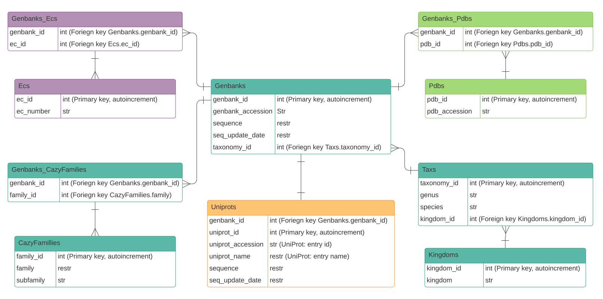

===================================
The Local CAZyme Database Structure
===================================

To facilitate the thorough interrogation of data retrieved from CAZy and minimise storing duplicate and redundant data, data retrieved from CAZy is stored in a local SQL database. 
Every CAZyme scraped from CAZy has the following data:

* Protein name
* CAZy (sub)family
* GenBank accession(s)

Each CAZyme may or may not have the following data, depending on the entry:

* EC number(s)
* UniProt acession(s)
* PDB accession(s)

.. NOTE::
    EC numbers, UniProt accessions and PDB accessions can be retrieved from UniProt for CAZymes 
    in the local CAZyme database using ``cazy_webscraper``.

---------------
Database Schema
---------------

Below is the database ORM. It plots the relationships between elements in each table.

The database ORM (schema) can also be viewed `Here <https://hobnobmancer.github.io/cazy_webscraper/database_schema.pdf>`_

----------------------------------------------
Retrieve the schema of a local CAZyme database
----------------------------------------------

The schema of a local CAZyme database can be retrieved using ``cazy_webscraper``:

.. code-block:: bash
    cw_get_db_schema <path to local CAZyme database>

Alternatively, `sqlite3` can be used to retrieve the schema:

.. code-block:: bash
    sqlite3 <path to local CAZyme database> .schema

--------------
The Logs table
--------------

The database built by ``cazy_webscraper`` contains a table called 'Logs'. This table logs every 
scrape of CAZy, UniProt and GenBank which added data to the database.

The table contains the following columns and data:

* **log_id:** Autoincrement ID number
* **date:** Date scrape was initated (in ISO format)
* **time:** Time scrape was initated (in ISO format)
* **database:** Name of the external database from which data was retrieved (i.e. 'CAZy', 'UniProt' or 'GenBank')
* **retrieved_annotations:** List of annotation types retrieved (e.g. 'EC number, PDB accession, Sequence')
* **classes:** CAZy classes for which data was retrieved
* **families:** CAZy families for which data was retrievedclasses
* **kingdoms:** taxonomy Kingdoms filteres applied
* **genera_filter:** taxonomy Kingdoms filteres applied
* **species_filter:** taxonomy Kingdoms filteres applied
* **strains_filter:** taxonomy Kingdoms filteres applied
* **ec_filter:** EC fliters applied to retrieve data for CAZymes annotated with the specified EC numbers (only applies to retrieval of data from UniProt, GenBank and PDB)
* **cmd_line:** Reproduction of the command line arguments passed to ``cazy_webscraper``.

The 'Logs' table allows any one who uses the database to see how the dataset was compiled.

--------
Genbanks
--------

The Genbanks table contains data retrieved from CAZy and NCBI GenBank. From CAZy the GenBank protein accession. 
The protein sequence for the protein can be retrieved from NCBI GenBank using ``cazy_webscraper``, and stored 
in the Genbanks table, as well as the date the sequence was updated in NCBI. The sequence update date is used 
to check if a newly retrieved protein sequence from GenBank is newer than the sequence stored in the database, and the 
sequence in the database should be updated.

---------------------
Genbanks_CazyFamilies
---------------------

The Genbanks_CazyFamilies table is a relationship. The table defines which protein is 
assigned to which CAZy family.

------------
CazyFamilies
------------

The CazyFamilies lists of CAZy families retrieved from CAZy. If CAZy subfamilies are retrieved 
each CAZy subfamily is associated with its parent CAZy family.

----
Taxs
----

The Taxs table stores taxonomy database, storing the genus and species of the source organisms of CAZymes 
retrieved from CAZy. Each source organism is associated with a taxonomic class.

--------
Kingdoms
--------

The Kingdoms table lists all taxonomic kingdoms of the source organisms downloaded from CAZy.

--------
UniProts
--------

The UniProts table contains protein data retrieved from UniProt using ``cazy_webscraper``. This includes: 

* UniProt ID
* Protein name
* Protein sequence
* Date the protein sequence was last upated in UniProt

------------
Genbanks_Ecs
------------

The Genbanks_Ecs table is a relationship table, and defines which proteins are annotated with which EC numbers. 

---
Ecs
---

The Ecs table lists all EC numbers retrieved from UniProt using ``cazy_webscraper``. The EC numbers stored in the 
local CAZome database are do not have the 'EC' prefix.

-------------
Genbanks_Pdbs
-------------

The Genbanks_Pdbs is a relationship table, and defines which PDB accessions belong to which protein.

----
Pdbs
----

The Pdbs table contains all PDB accessions retrieved from UniProt using ``cazy_webscraper``.

.. NOTE::
    Not all PDB accessions represented in a CAZyme record at CAZy are necessarily present in PDB. For example, some accessions are placeholders while structures are under embargo.

.. NOTE::
    PDB/RCSB protein structures are not recorded in the local SQLite3 database. They are written to disk in a user-specified directory.

----------
The Schema
----------

As of `cazy_webscraper` version >= 2.3.0, the schema of a local CAZyme database will be:

.. code-block:: bash

    CREATE TABLE IF NOT EXISTS "Kingdoms" (
            kingdom_id INTEGER NOT NULL, 
            kingdom VARCHAR, 
            PRIMARY KEY (kingdom_id), 
            UNIQUE (kingdom)
    );
    CREATE TABLE IF NOT EXISTS "GtdbTaxs" (
            gtdb_tax_id INTEGER NOT NULL, 
            kingdom VARCHAR, 
            phylum VARCHAR, 
            tax_class VARCHAR, 
            tax_order VARCHAR, 
            family VARCHAR, 
            genus VARCHAR, 
            species VARCHAR, 
            release VARCHAR, 
            PRIMARY KEY (gtdb_tax_id), 
            UNIQUE (kingdom, phylum, tax_class, tax_order, family, genus, species, release)
    );
    CREATE TABLE IF NOT EXISTS "CazyFamilies" (
            family_id INTEGER NOT NULL, 
            family VARCHAR NOT NULL, 
            subfamily VARCHAR, 
            PRIMARY KEY (family_id), 
            UNIQUE (family, subfamily)
    );
    CREATE INDEX fam_index ON "CazyFamilies" (family, subfamily);
    CREATE TABLE IF NOT EXISTS "NcbiTaxs" (
            ncbi_tax_id INTEGER NOT NULL, 
            kingdom VARCHAR, 
            phylum VARCHAR, 
            tax_class VARCHAR, 
            tax_order VARCHAR, 
            family VARCHAR, 
            genus VARCHAR, 
            species VARCHAR, 
            strain VARCHAR, 
            PRIMARY KEY (ncbi_tax_id), 
            UNIQUE (ncbi_tax_id)
    );
    CREATE INDEX ncbi_index ON "NcbiTaxs" (ncbi_tax_id, genus, species);
    CREATE TABLE IF NOT EXISTS "Uniprots" (
            uniprot_id INTEGER NOT NULL, 
            uniprot_accession VARCHAR, 
            uniprot_name VARCHAR, 
            sequence VARCHAR, 
            seq_update_date VARCHAR, 
            PRIMARY KEY (uniprot_id), 
            UNIQUE (uniprot_accession)
    );
    CREATE INDEX uniprot_option ON "Uniprots" (uniprot_id, uniprot_accession);
    CREATE TABLE IF NOT EXISTS "Ecs" (
            ec_id INTEGER NOT NULL, 
            ec_number VARCHAR, 
            PRIMARY KEY (ec_id), 
            UNIQUE (ec_number)
    );
    CREATE INDEX "ix_Ecs_ec_number" ON "Ecs" (ec_number);
    CREATE TABLE IF NOT EXISTS "Pdbs" (
            pdb_id INTEGER NOT NULL, 
            pdb_accession VARCHAR, 
            PRIMARY KEY (pdb_id), 
            UNIQUE (pdb_accession)
    );
    CREATE INDEX pdb_idx ON "Pdbs" (pdb_accession);
    CREATE TABLE IF NOT EXISTS "Logs" (
            log_id INTEGER NOT NULL, 
            date VARCHAR, 
            time VARCHAR, 
            "database" VARCHAR, 
            retrieved_annotations VARCHAR, 
            classes VARCHAR, 
            families VARCHAR, 
            kingdoms VARCHAR, 
            genera_filter VARCHAR, 
            species_filter VARCHAR, 
            strains_filter VARCHAR, 
            ec_filter VARCHAR, 
            cmd_line VARCHAR, 
            PRIMARY KEY (log_id)
    );
    CREATE TABLE IF NOT EXISTS "Taxs" (
            taxonomy_id INTEGER NOT NULL, 
            genus VARCHAR, 
            species VARCHAR, 
            kingdom_id INTEGER, 
            PRIMARY KEY (taxonomy_id), 
            UNIQUE (genus, species), 
            FOREIGN KEY(kingdom_id) REFERENCES "Kingdoms" (kingdom_id)
    );
    CREATE INDEX organism_option ON "Taxs" (taxonomy_id, genus, species);
    CREATE TABLE IF NOT EXISTS "Genomes" (
            genome_id INTEGER NOT NULL, 
            assembly_name VARCHAR, 
            gbk_version_accession VARCHAR, 
            gbk_ncbi_id INTEGER, 
            refseq_version_accession VARCHAR, 
            refseq_ncbi_id INTEGER, 
            gtdb_tax_id INTEGER, 
            PRIMARY KEY (genome_id), 
            UNIQUE (assembly_name, gbk_version_accession, refseq_version_accession), 
            FOREIGN KEY(gtdb_tax_id) REFERENCES "GtdbTaxs" (gtdb_tax_id)
    );
    CREATE INDEX genome_options ON "Genomes" (assembly_name, gbk_version_accession, refseq_version_accession);
    CREATE TABLE IF NOT EXISTS "Genbanks" (
            genbank_id INTEGER NOT NULL, 
            genbank_accession VARCHAR, 
            sequence VARCHAR, 
            seq_update_date VARCHAR, 
            taxonomy_id INTEGER, 
            ncbi_tax_id INTEGER, 
            uniprot_id INTEGER, 
            PRIMARY KEY (genbank_id), 
            UNIQUE (genbank_accession), 
            FOREIGN KEY(taxonomy_id) REFERENCES "Taxs" (taxonomy_id), 
            FOREIGN KEY(ncbi_tax_id) REFERENCES "NcbiTaxs" (ncbi_tax_id), 
            FOREIGN KEY(uniprot_id) REFERENCES "Uniprots" (uniprot_id)
    );
    CREATE INDEX "ix_Genbanks_genbank_accession" ON "Genbanks" (genbank_accession);
    CREATE TABLE IF NOT EXISTS "Genbanks_Genomes" (
            genbank_id INTEGER NOT NULL, 
            genome_id INTEGER NOT NULL, 
            PRIMARY KEY (genbank_id, genome_id), 
            FOREIGN KEY(genbank_id) REFERENCES "Genbanks" (genbank_id), 
            FOREIGN KEY(genome_id) REFERENCES "Genomes" (genome_id)
    );
    CREATE TABLE IF NOT EXISTS "Genbanks_CazyFamilies" (
            genbank_id INTEGER NOT NULL, 
            family_id INTEGER NOT NULL, 
            PRIMARY KEY (genbank_id, family_id), 
            FOREIGN KEY(genbank_id) REFERENCES "Genbanks" (genbank_id), 
            FOREIGN KEY(family_id) REFERENCES "CazyFamilies" (family_id)
    );
    CREATE TABLE IF NOT EXISTS "Genbanks_Ecs" (
            genbank_id INTEGER NOT NULL, 
            ec_id INTEGER NOT NULL, 
            PRIMARY KEY (genbank_id, ec_id), 
            FOREIGN KEY(genbank_id) REFERENCES "Genbanks" (genbank_id), 
            FOREIGN KEY(ec_id) REFERENCES "Ecs" (ec_id)
    );
    CREATE TABLE IF NOT EXISTS "Genbanks_Pdbs" (
            genbank_id INTEGER NOT NULL, 
            pdb_id INTEGER NOT NULL, 
            PRIMARY KEY (genbank_id, pdb_id), 
            FOREIGN KEY(genbank_id) REFERENCES "Genbanks" (genbank_id), 
            FOREIGN KEY(pdb_id) REFERENCES "Pdbs" (pdb_id)
    );
