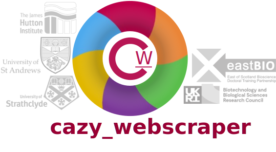

.. cazy_webscraper documentation master file, created by
   sphinx-quickstart on Fri Nov 20 15:33:10 2020.
   You can adapt this file completely to your liking, but it should at least
   contain the root ``toctree`` directive.

===========================================
Welcome to cazy_webscraper's documentation!
===========================================

| For all the latest updates, and development progress make sure to check the `GitHub repository <https://github.com/HobnobMancer/cazy_webscraper>`_

.. image:: https://img.shields.io/badge/Version-v1.0.2-yellowgreen
   :target: https://github.com/HobnobMancer/cazy_webscraper
.. image:: https://zenodo.org/badge/DOI/10.5281/zenodo.4300858.svg
   :target: https://doi.org/10.5281/zenodo.4300858
.. image:: https://img.shields.io/badge/Licence-MIT-brightgreen
   :target: https://img.shields.io/badge/Licence-MIT-brightgreen
.. image:: https://circleci.com/gh/HobnobMancer/cazy_webscraper.svg?style=shield
   :target: https://circleci.com/gh/HobnobMancer/cazy_webscraper
.. image:: https://codecov.io/gh/HobnobMancer/cazy_webscraper/branch/master/graph/badge.svg
   :target: https://codecov.io/gh/HobnobMancer/cazy_webscraper
.. image:: https://img.shields.io/badge/Python-v3.8.---orange
   :target: https://www.python.org/about/
.. image:: https://img.shields.io/badge/Bioinformatics-EASTBio-ff69b4
   :target: http://www.eastscotbiodtp.ac.uk/eastbio-student-cohort-2019
.. image:: https://img.shields.io/badge/BIOCONDA-integration-brightgreen
   :target: https://bioconda.github.io/user/install.html
.. image:: https://img.shields.io/conda/dn/bioconda/cazy_webscraper?label=Bioconda%20downloads
   :target: https://bioconda.github.io/user/install.html
.. image:: https://img.shields.io/badge/Pypi-integration-brightgreen
   :target: https://pypi.org/project/cazy-webscraper/
.. image:: https://img.shields.io/pypi/dm/cazy_webscraper?label=Pypi%20downloads
   :target: https://pypi.org/project/cazy-webscraper/

``cazy_webscraper`` is a Python3 package for the automated retrieval of carbohydrate-active enzyme (CAZyme) data from the `CAZy <http://wwww.cazy.org/>`_ database. This program is free to use under the MIT license, and we kindly request that, if you use this program or Python package, you cite it as indicated below.

   Hobbs, Emma E. M.; Pritchard, Leighton; Chapman, Sean; Gloster, Tracey M. (2021): cazy_webscraper Microbiology Society Annual Conference 2021 poster. figshare. Poster. https://doi.org/10.6084/m9.figshare.14370860.v7 

``cazy_webscraper`` retrieves data from CAZy, writing it to a local SQLite3 file. ``cazy_webscraper`` can retrieve the protein sequences from NCBI, for CAZymes in the local database, and also write out those sequences in FASTA format. Additionally, ``cazy_webscraper`` can retrieve protein structures from the Research Collaboratory for Structural Bioinformatics (RCSB) Protein Data Bank, `PDB <https://www.rcsb.org/>`_, for CAZymes in the local database.

``cazy_webscraper`` can be configured to scrape the entire CAZy database, to recover only CAZymes filtered by user-supplied criteria, such as CAZy classes, CAZy (sub)family, or taxonomy. 

----------
Quickstart
----------

.. toctree::
   :maxdepth: 4
   
   quickstart

-------------
Best practice
-------------

When performing a series of many, automated, repeated calls to a server it is polite to do this when internet traffic is lowest *at the server*. This is typically at the weekend and overnight.

The webscraper can appear to run slowly but this may be due to the bandwidth at the CAZy server, or server speed. ``cazy_webscraper`` provides a progress bar to reassure the user that the webscraper is working. 

.. WARNING::
   **Please do not perform a complete scrape of the CAZy database unless you specifically require to reproduce the entire CAZy dataset. A complete scrape will take several hours and may unintentionally deny the service to others.**

-------------
Documentation
-------------

For details and updates on development, please consult the `GitHub repository <https://github.com/HobnobMancer/cazy_webscraper>`_.

.. toctree::
   :maxdepth: 2
   
   installation
   usage
   tutorial
   database
   genbank
   pdb
   license

--------------------------
Citing ``cazy_webscraper``
--------------------------
 
If you use ``cazy_webscraper`` in your work *please* do cite our work (including the provided DOI), as well as the specific version of the tool you use. This is not only helpful for us as developers to get out work out into the world, but it is also **essential for the reproducibility and integrity of scientific research**. Citation:
   
   Hobbs, Emma E. M.; Pritchard, Leighton; Chapman, Sean; Gloster, Tracey M. (2021): cazy_webscraper Microbiology Society Annual Conference 2021 poster. FigShare. Poster. https://doi.org/10.6084/m9.figshare.14370860.v7 

----------------------
Development and issues
----------------------

If there are additional features you wish to be added, you have problems with the scraper, or want to contribute please raise an issue at the `GitHub repository <https://github.com/HobnobMancer/cazy_webscraper>`_.

* Issues Page: `https://github.com/HobnobMancer/cazy_webscraper/issues <https://github.com/HobnobMancer/cazy_webscraper/issues>`_